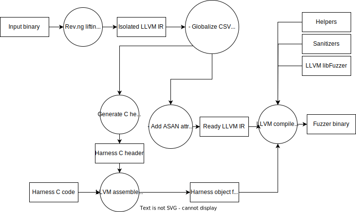

# Make black-box fuzzing as convenient as white-box with rev.ng and libFuzzer in the embedded world context

## Abstract

The realm of fuzzing in embedded systems presents a broader array of challenges compared to traditional user mode binaries. These encompass coping with binaries compiled for architectures distinct from our own, managing distinct hardware prerequisites, and more. The predominant solution currently advocated involves employing emulation as the foundation and building a fuzzer on this framework. Nonetheless, this approach introduces an inherent overhead due to runtime instrumentation, while the efficacy in addressing IoT challenges hinges on the chosen emulation system. Alternatively, drawing inspiration from the research of Antonio Frighetto, another approach involves elevating the embedded binary to an intermediate representation, such as LLVM IR in our case. By incorporating instrumentation during compilation, this technique diminishes runtime overhead and enables reliance on white-box fuzzing engines.

## Thanks

Before delving into the intricate realm of LLVM, I wish to express my gratitude to Riscure ; this entire blog post is founded upon the endeavors undertaken during my internship. I extend my thanks to Antonio Frighetto, the author of the master thesis, whose source code remains unpublished. His meticulously structured blog posts and thesis have proven to be invaluable resources. Without these comprehensive materials, I likely would have spent many additional weeks in the pursuit of developing this prototype. Lastly, my appreciation goes to rev.ng for furnishing a powerful open-source engine, and for facilitating meaningful connections.

## Contents
- [Make black-box fuzzing as convenient as white-box with rev.ng and libFuzzer in the embedded world context](#make-black-box-fuzzing-as-convenient-as-white-box-with-revng-and-libfuzzer-in-the-embedded-world-context)
  - [Abstract](#abstract)
  - [Thanks](#thanks)
  - [Contents](#contents)
  - [Abbreviations](#abbreviations)
  - [Definitions](#definitions)
  - [Introduction](#introduction)
  - [What is rev.ng](#what-is-revng)
    - [How it actually works](#how-it-actually-works)
    - [The `root` function](#the-root-function)
    - [The `CSV`](#the-csv)
    - [Constant data and other segment related data](#constant-data-and-other-segment-related-data)
    - [Function isolation](#function-isolation)
    - [Enforcing the ABI](#enforcing-the-abi)
  - [What is rev.ng-fuzz](#what-is-revng-fuzz)
    - [How it actually works](#how-it-actually-works-1)
    - [Harness header generation](#harness-header-generation)
    - [Enable hooking](#enable-hooking)
    - [Sanitizers](#sanitizers)
    - [How to use it](#how-to-use-it)
  - [Let's implement our own pipeline](#lets-implement-our-own-pipeline)
    - [How it actually works (again)](#how-it-actually-works-again)
    - [Rev.ng lifting and isolation](#revng-lifting-and-isolation)
    - [GlobalizeCSV](#globalizecsv)
    - [Cut root](#cut-root)
    - [Prepare hook](#prepare-hook)
    - [Generate C header](#generate-c-header)
      - [Print included headers](#print-included-headers)
      - [Print setup stack](#print-setup-stack)
      - [Print CSV](#print-csv)
      - [Print globals](#print-globals)
      - [Print isolated functions](#print-isolated-functions)
      - [Print hooked functions](#print-hooked-functions)
      - [Print functions wrappers](#print-functions-wrappers)
        - [CPU register based arguments](#cpu-register-based-arguments)
        - [Stack arguments](#stack-arguments)
    - [Add ASAN attribute](#add-asan-attribute)
    - [ASAN interface](#asan-interface)
      - [How to find local variables](#how-to-find-local-variables)
      - [How to instrument the code in the good way](#how-to-instrument-the-code-in-the-good-way)
    - [Drop main](#drop-main)
    - [Some architecture specific patchs](#some-architecture-specific-patchs)
    - [A little overview : the stack inspector](#a-little-overview--the-stack-inspector)
    - [Another little overview : type infering](#another-little-overview--type-infering)
  - [Lets test our pipeline : simple target](#lets-test-our-pipeline--simple-target)
  - [Conclusion](#conclusion)
  - [References](#references)
    - [LLVM](#llvm)
    - [Rev.ng](#revng)
    - [Recover ABI and local variables](#recover-abi-and-local-variables)
    - [ASAN](#asan)
    - [SanCov](#sancov)
    - [Survey on fuzzing techniques](#survey-on-fuzzing-techniques)

## Abbreviations

- ABI  : Application Binary Interface
- ASAN : Address Sanitizer
- BP   : Base pointer
- CSV  : CPU State Variables
- IR   : Intermediate Representation
- JT   : Jump Target
- SMT  : Satisfiability Modulo Theories
- SP   : Stack pointer
- SSA  : Single Statement Assignement

## Definitions

- <a name="Lifter"></a>Lifter : Software able to convert a binary to an intermediate representation.

## Introduction

In this blog post, I am excited to share the outcomes of my internship experience with [Riscure](https://www.riscure.com/). The focus of my internship revolved around research, specifically centered on the exploration of a particular fuzzing technique detailed in this [blog post](https://rev.ng/blog/fuzzing/post.html) and its accompanying [master thesis](https://antoniofrighetto.com/master_thesis.pdf). The objective assigned to me was to delve into the intricacies of this fuzzing approach.

## What is rev.ng

As previously said, rev.ng is a lifter able to lift an equivalent code in the [LLVM](https://en.wikipedia.org/wiki/LLVM) [intermediate representation](https://en.wikipedia.org/wiki/Intermediate_representation) format from the [following architectures](https://github.com/revng/revng/blob/60ebfa950d570274f60bd0b6375bf1d853634575/lib/Lift/LinkSupportPipe.cpp#L54) :
- x86
- x86_64
- arm
- aarch64
- mips
- mipsel
- systemz

The lifted binary is compilable in architectureany of the architectures supported by LLVM/Clang (in particular, x86-64), and should have the same comportment as the original one.

### How it actually works 

Rev.ng leverage the [QEMU](https://en.wikipedia.org/wiki/QEMU) [TCG](https://wiki.qemu.org/Documentation/TCG) and the LLVM IR. The first one is the intermediate representation used by the QEMU emulation tool and the second one the LLVM intermediate representation. Accordingly to the [presentation paper](https://rev.ng/downloads/iccst-18-paper.pdf), the lifting process is the following :

```
┌──────────────────────┐    ┌──────────────────────┐
│Collect JT from global│    │Lift to QEMU IR       │
│data                  ├───►│                      │
└──────────────────────┘    └───▲───────────────┬──┘
                                │               │
               ┌────────────────┴──┐     ┌──────▼────────────────┐
               │Collect JT from    │     │Translate to LLVM IR   │
               │                   │◄────┤                       │
               └───────────────┬───┘     └───────────────────────┘
                               │
               ┌───────────────▼───┐
               │Identify function  │
               │boundaries         │
               └──────────────┬────┘
                              │
               ┌──────────────▼────┐
               │Link runtime       │
               │functions          │
               └───────────────────┘
```


### The `root` function

This function contains the dispatcher, a segment of code tasked with directing the execution flow to the appropriate basic block. To elucidate the concept of the `root` function, let's delve into a hypothetical example:

```c original code
int main(void) {
    if random() < 256 {
        return 1:
    }

    return 0;
}
```

```c simplified translated code
void root(char *sp) {
    uint64_t ret, current_pc;

    current_pc = 0;
    while(true) {
        switch(current_pc) {
            case 0: 
                current_pc = random() < 256 ? 1 : 2;
                break;
            
            case 1:
                ret = 1;
                current_pc = 3;
                break:
            
            case 2:
                ret = 0;
                current_pc = 3;
                break;
            
            case 3;
                exit(ret);
                break;
            
            default:
                error_handling();
                break:
        }
    }
}
```

### The `CSV`

The CPU State Variables (CSV) represent a methodology devised by Rev.ng and inherited from QEMU to address architecture-specific considerations. To provide a simplified understanding of its functionality: all registers and memory areas inherited from the original architecture are linked to global variables. The instructions of the target architecture encapsulate access to these variables. Consequently, the translated binary undergoes execution through emulating the original binary, devoid of any runtime instrumentation. Instead, all instrumentation is implemented during compilation, resulting in faster performance compared to pure emulation. Continuing from earlier, an illustrative example is presented below:

```asm x64 source code
func:
    xor rax, rax

    cmp rdi, 1
    je .end

    inc rax

    .end:
        ret
```

```c translated pseudo-code
uint64_t rax, rdi;

void func(void) {
    rax = rax ^ rax;
    rax = rdi==1 ? 0 : 1;
}
```

### Constant data and other segment related data

Segments are meticulously mapped from the source binary to the translated version, precisely to the appropriate virtual addresses. Consider the scenario where your binary is reliant on a data section situated at address 0x40000. In the translated binary, this specific data section is mapped at the identical address, 0x40000, facilitating straightforward and direct access.

### Function isolation

Function isolation is a distinctive feature offered by rev.ng that comes into play post the lifting process. This feature is responsible for dissecting the root function into its original constituent functions. To illustrate this concept further, let's revisit the initial example :

```c
int main(void) {
    if random() < 256 {
        return 1:
    }

    return 0;
}
```

Upon applying function isolation, the above example lifts into :

```c simplified translated and isolated code
uint64_t rax;

void root(char *sp) {
    uint64_t current_pc;

    current_pc = 0;
    while(true) {
        switch(current_pc) {
            case 0:
                main()
                exit(rax);
                break;
                        
            default:
                error_handling();
                break:
        }
    }
}

void main(void) {
    rax = 0;
    if random() < 256 {
        rax = 1;
    } 
}
```

### Enforcing the ABI

This represents yet another distinctive feature within the rev.ng toolkit. It endeavors to reinstate the original [ABI](https://en.wikipedia.org/wiki/Application_binary_interface) of a function, mirroring its configuration from the source binary. To provide a clearer understanding, consider the following example:

```c
int add(int a, int b) {
    return a + b;
}
```

```c simplified translated, isolated and enforced ABI code without the root function
uint64_t rax;

int add(int a, int b) {
    rax = a + b;
    return rax;
}
```

As you can see this pass is really interesting as it allows us to call isolated functions in the same ways as in the original codebase (so before compilation). Unfortunately, the current version of EnforceAbi has a limited support in the open-source version ; even state-of-the-art tools as [IDA](https://hex-rays.com/ida-pro/) or [Ghidra](https://ghidra-sre.org/) are not able to consistently retrieve the correct ABI from the analysed functions. As an example about how complicated could be to fully enforce the ABI, let's try apply it to the following code :

```c input source code
extern "C" uint32_t Hard(uint8_t a, uint8_t b, uint8_t c, uint8_t d, uint8_t e, uint8_t f, uint8_t g, uint8_t h, uint8_t i, uint8_t j, uint8_t k, uint8_t l, uint8_t m) {
  return a + b + c + d + e + f + g + h + i + j + k + l + m;
}
```

After compilation of this code for the Aarch64 architecture and execution of the following commands to get the lifted binary with enforced ABI, we obtain the following results :

```fish commands to produce the enforced ABI
(orc) root[0]/t/test > ls
main.c
(orc) root[0]/t/test > aarch64-none-linux-gnu-c++ -static -nostdlib -O0 -fno-stack-protector  main.c -o main
/opt/arm-gnu-toolchain-12.2.rel1-x86_64-aarch64-none-elf/bin/../lib/gcc/aarch64-none-elf/12.2.1/../../../../aarch64-none-elf/bin/ld: warning: cannot find entry symbol _start; defaulting to 0000000000400000
(orc) root[0]/t/test > ls
main  main.c
(orc) root[0]/t/test > file main
main: ELF 64-bit LSB executable, ARM aarch64, version 1 (SYSV), statically linked, not stripped
(orc) root[0]/t/test > revng analyze --resume debug ImportBinary main > /dev/null
(orc) root[0]/t/test > revng analyze --resume debug DetectABI main > /dev/null
(orc) root[0]/t/test > revng artifact --resume debug EnforceABI main > /dev/null
(orc) root[0]/t/test > ls debug/EnforceABI/
module.ll
(orc) root[0]/t/test > file debug/EnforceABI/module.ll
debug/EnforceABI/module.ll: ASCII text, with very long lines (37736)
```

```llvm-ir retrieved ABI
define i64 @local_Hard(i64 %x0_aarch64, i64 %x1_aarch64, i64 %x2_aarch64, i64 %x3_aarch64, i64 %x4_aarch64, i64 %x5_aarch64, i64 %x6_aarch64, i64 %x7_aarch64)
```

As you can see, arguments passed on the stack are not retrieved (discovered) by EnforceABI. With [this](https://github.com/revng/revng/issues/315) issue, I had the confirmation that they are able to find these parameters (and many more !) in some analyses attached to the revng-c decompiler.

## What is rev.ng-fuzz

Rev.ng-fuzz is the name of the extension of the rev.ng tool which allows fuzzing of binaries. The concept is exposed in this [blog post](https://rev.ng/blog/fuzzing/post.html) and its associated [master thesis](https://antoniofrighetto.com/master_thesis.pdf).

### How it actually works

Referring the figure 3.1 of the master thesis, the fuzzing pipeline of rev.ng-fuzz is the following :


As you can see, the rev.ng tool is used to lift and isolate the input binary. The isolated LLVM IR is used to produce a C header file allowing the development of the LLVM libFuzzer harness. This harness and the isolated IR prepared for hooking are instrumented by libFuzzer and the [sanitizers](https://en.wikipedia.org/wiki/Code_sanitizer) to produce the fuzz binary.

### Harness header generation

The harness header generation is crucial to simplify the development of the harness code. The generated header allows us to :
- Expose the input binary functions
- Expose the CSV
- Expose wrappers with retrieved ABI from the input functions
- Hook input binary functions

### Enable hooking

This is an [LLVM pass](https://llvm.org/docs/WritingAnLLVMPass.html) which creates a clone of each isolated function in the IR, renames the original function and calls the original function in the cloned function. The following C code illustrate what this pass does (but keep in mind that it operates with LLVM IR instead of C code) :

```c before hooking pass
void b(void) {}
void a(void) { b(); }
```

```c after hooking pass
void b_impl(void) {}
void b(void) { b_impl(); }
void a_impl(void) { b(); }
void a(void) { a_impl(); }
```

As you can see, we can change the behaviour of original function by just changing the body of functions without the _impl suffix.

### Sanitizers

An overt objective of this framework is to capitalize on existing sanitizers. While this objective has been successfully achieved with certain sanitizers, others have not been fully addressed. For instance, the [sanitizer coverage](https://clang.llvm.org/docs/SanitizerCoverage.html), which facilitates the identification of covered instruction groups during execution, is readily employable. Since it essentially introduces calls to functions responsible for tracking reached instructions, it can be directly applied to the lifted and isolated binary without necessitating modifications. However, doubts arise when considering other sanitizers. Take, for example, the [address sanitizer](https://github.com/google/sanitizers/wiki/AddressSanitizer). It is not entirely operational, and regrettably, it seems to disrupt the fuzz binary. This sanitizer essentially encompasses three key features :
- Track dynamically heap allocated problems (as overflows, underflows, double free, memory leak...)
- Track global variables problems (as overflows, underflows...)
- Track stack memory problems (as overflows, underflows...)

The master thesis expounds upon the first feature, leaving no room for skepticism. Given our capacity to hook functions, we can seamlessly replace the implementations of `malloc` and `free` with their counterparts sourced from the address sanitizer runtime library. In terms of global variables, select variables can be subjected to instrumentation. A prime instance is the CSV `rax` value, demonstrated in Figure 3.6 of the paper. However, a significant hurdle emerges when contemplating stack instrumentation. As discussed earlier, the input binary is emulated within the translated binary. This necessitates the existence of two distinct stacks: the authentic process stack and a pseudo stack allocated to the emulated binary. This pseudo stack is conferred to the emulated binary through the utilization of the CSV stack register of the input architecture. An illustrative example will serve to clarify this intricate concept :

```asm input binary
;
; This function follw the linux x64 ABI, so :
;   - RDI = parameter 1
;   - RAX = return
;
add:
    push rbp                 ; save previous base pointer
    mov rbp, rsp             ; set empty stack frame
    sub rsp, 8               ; allocate 8 bytes on the function stack frame
    mov qword ptr [rbp-8], 0 ; set counter to 0

    .loop:
        cmp qword ptr [rbp-8], 0x10 ; if counter 0x10
        je .end                     ; jump to the end
                                    ; else
        inc rdi                     ; increment parameter
        mov rax, qword ptr [rbp-8]  ; |-------------------|
        inc rax                     ; | increment counter |
        mov qword ptr [rbp-8], rax  ; |-------------------|
        jmp .loop                   ; jump to begin of loop

    .end
        mov rax, rdi ; set return value
        leave        ; restablish previous stack frame
        ret          ; return to caller
```

```c simplified pseudo-code of the translated binary by considering the input architecture as x64
uint64_t rax, rdi, rsp, rbp, rip;

void add(void) {
    rsp[-1] = rbp;
    rsp = rsp - 8;
    rbp = rsp;
    rsp = rsp - 8;
    for(rbp[-1]=0; rbp[-1]<0x10; rbp[-1]++) {
        rdi++;
    }
    rax = rdi;
    rsp = rbp;
    rbp = rsp[0];
    rsp = rsp - 8;
    rip = rsp[0];
    rsp = rsp - 8;
    return;
}
```

It's crucial to acknowledge that the pseudo C code depicted in the code block is ultimately compiled into x64 assembly. Consequently, all the code presented will be translated into assembly, which, as previously elucidated, serves as a conduit to manage accesses to the CSV. This signifies that translated functions do not incorporate any local variables originating from the input binary, which would be represented as [alloca](https://llvm.org/docs/LangRef.html#alloca-instruction) instructions in the LLVM IR. Given the absence of these explicit alloca instructions, the Clang implementation of ASAN encounters impediments in instrumenting the stack. As such, the implementation outlined might not be fully equipped to address the stack facet of ASAN. 

### How to use it

I would be honored to speak about more implementation details, but I will let you read the master thesis if you want to know about some gorry details. Moreover there is not many more details. And in fact if you want to use this framework or just see the code to know about implementation details it is not possible as the code is not released, and will probably no be soon : see my [github issue](https://github.com/revng/revng/issues/304) to understand my guess.

## Let's implement our own pipeline

As we cannot rely on some code, even not runnable, I implemented my own pipeline. The exposed goals are :
- to allow easier way to hook functions
- to provide a convenient harness with wrappers functions, exposing both recovered parameters and their infered types
- to be able to deal with ASAN stack instrumentation up to some extent and try to leverage all the existing sanitizers

The aforementioned features were implemented to help porting the Aarch64 and Arm32 to x86-64, using the ELF binary format. In particular, for 32 bits architectures, we will target the [x32 linux ABI](https://en.wikipedia.org/wiki/X32_ABI) to adjust the pointer size to 32 bits. Thus, addresses can fill in 32 bits CSV variables (which, as mentioned before, represent 32 bits registers of input architecture).

### How it actually works (again)

The following figure summarizes the global pipeline for creating fuzzing test cases :



As you can see, the proposed approach is very similar with respect to the one implemented in rev.ng. The following sections explains the detail of every step.

### Rev.ng lifting and isolation

As in rev.ng-fuzz, we rely in these two rev.ng features to have a LLVM IR to work on.

### GlobalizeCSV

This LLVM pass will perform two distinct tasks. The first one involves configuring the linkage of all CSV variables as [external](https://llvm.org/docs/LangRef.html#linkage-types), thereby enabling their declaration and usage from the harness header. The second task encompasses the removal of all definitions related to helper functions that are intended for replacement. Instead, only [weak](https://llvm.org/docs/LangRef.html#linkage-types) declarations of these functions are retained. This latter action serves a particular purpose due to the existence of special operations in the input binary that are not straightforwardly translated into direct QEMU TCG code; instead, they are enveloped within helper functions. For instance, consider the case of a 64-bit division, which is encapsulated within a helper function that may resemble the following structure :

```c QEMU division helper
int div(int a, int b) {
    if(b == 0) { return 0; }
    return (int)(a/b);
}
```

As you can see, the helper is rather safe (the division by zero is not allowed). In a fuzzing context, this is not desirable as we want to detect this bug. That is why we just drop the body of functions like this and add another body which exposes the bug. You can see these helpers in the box at the top right corner of the previous figure.

### Cut root

In our earlier discussion about the `root` function, I left out a key aspect: its role in initializing a context before managing the execution flow. Prior to orchestrating the execution flow, this function undertakes the responsibility of establishing certain CSV variables, thereby setting the stage for subsequent operations. While the execution flow management component is unnecessary for our purposes, we will introduce a [return](https://llvm.org/docs/LangRef.html#ret-instruction) instruction at the conclusion of the initialization phase. This adaptation allows us to invoke the `root` function solely for the purpose of initializing our context.

### Prepare hook

This LLVM pass is designed to clone all isolated functions, subsequently discarding the body of the cloned version to retain only an external weak-linked function declaration. This maneuver empowers us to develop hooks directly within the produced C harness header. To illustrate this concept, consider the following example :

```c before prepare hook pass
void a(void) {}
void b(void) { a(); }
```

```c after prepare hook pass
void _a(void) {}
void _b(void) { a(); }
extern void a(void);
extern void b(void);
```

The generated C header will incorporate rudimentary hook functions that, by default, invoke the original functions. This constitutes the initial enhancement introduced by this implementation: the process of developing hooks in the generated header becomes straightforward and convenient.

### Generate C header

The algorithm to do this is the following :

```c generate C header algorithm
Module M;

print_included_heders();
print_setup_stack();

for(GlobalVariable &V : M.globals()) {
    if(is_csv(V)) {
        print_csv(V);
    }
}

set<size_t> Offsets;
for(Function &F : M.functions()) {
    for(size_t Offset : seems_global(F)) {
        Offsets.append(Offset);
    }
}
print_globals(Offsets);

for(Function &F : M.functions()) {
    if(is_isolated(F)) {
        print_isolated_function(F);
    }
}

for(Function &F : M.functions()) {
    if(is_hooked(F)) {
        print_hooked_function(F);
    }
}

for(Function &F : M.functions()) {
    if(is_isolated(F)) {
        print_function_wrapper(F);
    }
}
```

#### Print included headers

This function simply prints (on the generated header file) some often-used headers such as **stdio.h** or **stdlib.h**.

#### Print setup stack

As previously discussed, it's important to note that the stack within the translated binary doesn't align with the actual process stack. This function is responsible for outputting a helper that configures the pseudo stack. This function appears to resemble the one described in the master thesis :

```c setup stack helper
extern "C" void root(char *);
static char *stack = NULL;

void set_stack(void) {
	if(!stack) {
		stack = (char *)mmap(NULL, 0x100000, PROT_READ | PROT_WRITE, MAP_ANONYMOUS | MAP_PRIVATE | MAP_32BIT, -1, 0);
		if(!stack) {
			puts("Stack alloc failed...");
			exit(-1);
		}
		stack = stack + 0x100000 - 0x1000;
	}
	root(stack);
}
```

As evident from the description, this function essentially allocates a heap buffer once. Given the tendency of stacks to grow downward, the initial part of the allocated buffer is designated as the beginning of the stack, nearly aligning with the buffer's end. A segment of memory above this region is preserved to potentially configure certain stack values. Following this, the truncated `root` function is invoked to initialize the emulated CPU context.

#### Print CSV

In this pass, we iteratively traverse through all global variables. When a variable is identified as a CSV variable (identified through metadata attributed by rev.ng), it is printed.

#### Print globals

The goal of this part is to determine from function bodies if there is any global variable access in the input binary. For each integer converted directly in pointer, we assume that the integer is the address of a global. We will do some introspection to find the shape of the global type.

#### Print isolated functions

In this part, we perform an iterative sweep across all functions. If a function is recognized as an isolated function (distinguished through metadata furnished by rev.ng), we generate the declaration of that particular function.

#### Print hooked functions

In this section, we systematically iterate through all functions. Upon detecting a function marked as hooked (a classification enabled by the preparation for hook pass and associated metadata), we generate the function declaration along with a simplified body that exclusively invokes the original function.

#### Print functions wrappers

Now we're delving into the more intricate aspects. Unearthing the ABI of an isolated function from the IR proves to be a complex endeavor. In our scenario, the primary objective is to extract parameters and, if feasible, their types. Conversely, the return value is not of concern within our fuzzing context. Employing a synthesis of concepts from various papers, I've developed an approach that's nearly agnostic, allowing us to retrieve parameters from both registers and the stack.

##### CPU register based arguments

The following heuristics are used to detect which CSV value is a parameter :

```c find register arguments heuristics
for(GlobalVariable &V : M.globals()) {
    if(
        is_csv(V) && 
        is_not_stack_pointer(V) &&
        is_not_base_pointer(V) &&
        is_not_code_pointer(V) &&
        is_use_without_previous_def(V) &&
        is_not_only_preserved_on_stack(V)
    ) {
        // It is probably a function argument
    }
}
```

- is_csv check if the global is in the CSV.
- is_not_stack_pointer, is_not_base_pointer and is_not_code_pointer just exclude these three registers. This part is architecture dependant (we must know the name of these registers).
- is_use_without_previous_def check if the global variable value is used before any other value is putted in it. As an argument must be used, this value must not be changed before any utilisation.
- is_not_only_preserved_on_stack check if the global variable value is only preserved on the stack (for example pushed in the begin of the function and poped after all the body of the function). This part rely on a stack inspector module : I will speak a bit about it later.

##### Stack arguments

To identify stack arguments, we navigate through the instructions of the function. For each instruction associated with the stack, we attempt to determine the calculated offsets of the base pointer and stack pointer in relation to the first instruction of the function, which signifies an empty stack of size 0. Positive offsets correspond to parameters. To execute this, we need access to the base pointer's name, the stack pointer's name, and the dimension between the frame of the previous function and the present one. For instance, in the x64 architecture, as call instructions push the instruction pointer onto the stack, the size between arguments and the current function is 8 bytes—the size of the pushed register. This process is contingent on the presence of a stack inspector module as well.

### Add ASAN attribute

As elucidated in the master thesis, ASAN exclusively instruments functions adorned with a specific attribute. This pass is designed to bestow this attribute upon all isolated functions, ensuring their compatibility with ASAN instrumentation.

### ASAN interface

We explored two principal concepts for integrating ASAN with the lifted binary. The first involved identifying the stack size, emitting a single `alloca` instruction for the stack size, and mapping the stack pointer to this buffer. The primary advantage here lies in the simplicity of determining the stack size. However, this approach falls short in terms of inter-variable instrumentation, leading to the possibility of undetected bugs. The second concept entailed retrieving all local variables along with their sizes to emit multiple `alloca` instructions. While more intricate and prone to errors due to the complexity of obtaining local variables, this approach offers the benefit of inter-variable instrumentation. This implementation necessitates not only retrieving the local variables but also identifying all accesses to these variables in order to effectively instrument them, rather than merely connecting the pseudo stack with the real one. To illustrate these ideas, see the following code :

```c input source code
void fill(void) {
    char a[8];
    char b[8];

    for(int i=0; i<8; rax++) { a[i] = 0xaa; }
    for(int i=0; i<8; rax++) { b[i] = 0xbb; }
}
```

```c lifted without ASAN interface
void fill(void) {
    // Ommited prolog
    for(rax=0; rax<8; rax++) { *(char *)(&rbp[-1] + rax) = 0xaa; }
    for(rax=0; rax<8; rax++) { *(char *)(&rbp[-2] + rax) = 0xbb; }
    // Ommited epilog
}
```

```c lifted with first ASAN interface idea
void fill(void) {
    // Ommited prolog
    void *saved_rsp = rsp;
    void *saved_rbp = rbp;
    char a[16]; // 16 for the two buffers

    rsp = a;
    rbp = a + 16;
    for(rax=0; rax<8; rax++) { *(char *)(&rbp[-1] + rax) = 0xaa; }
    for(rax=0; rax<8; rax++) { *(char *)(&rbp[-2] + rax) = 0xbb; }
    rsp = saved_rsp;
    rbp = saved_rbp;
    // Ommited epilog
}
```

```c lifted with second ASAN interface idea
void fill(void) {
    // Ommited prolog
    char a[8];
    char b[8];
    
    for(rax=0; rax<8; rax++) { *(char *)(&rbp[-1] + rax) = 0xaa; a[rax] = 0xaa; }
    for(rax=0; rax<8; rax++) { *(char *)(&rbp[-2] + rax) = 0xbb; b[rax] = 0xbb; }
    // Ommited epilog
}
```

We choose the second idea for the more accurate ASAN instrumentation which will result, so we must deal with two problems : 
- how to find local variables
- how to instrument the code in the good way

#### How to find local variables

Similar to how we approached the identification of stack parameters, I'm leveraging the stack inspector module to navigate negative offsets. These offsets originate from the assumed zero values of the base pointer and stack pointer. By compiling these offsets, we can determine the size of a variable through the calculation of the difference between two distinct offsets. However, it's worth acknowledging that my little experience with ABI recognition highlights the challenges associated with it. Even widely used tools like IDA and Ghidra are not consistently accurate, reaffirming the intricacies of this task. This goes to show the complex nature of the work and the need for meticulous validation and refinement of results.

#### How to instrument the code in the good way

The two instructions which are important im my case are the load and store instructions. The algorithm in charge of instrumenting the code is roughly the following :

```c ASAN interface algorithm
//
// Algorithm inputs
//
map<int64_t, AllocaInst *> MappedAlloca;
vector<int64_t> Offsets;
vector<size_t> Sizes;

//
// Create alloca instructions and map them with their associated offsets
//
for(size_t Index=0; Index<Sizes.size(); Index++) {
    MappedAlloca[Offsets[Index]] = create_alloca_instr_at_the_begin_of_the_function(Sizes[Index]);
}

//
// Is this value patchable
//
function<AllocaInst *(Value *)> Patch = [&](Value *V) {
    if(
        (come_from_sp(V) || come_from_bp(V)) &&
        get_stack_offset(V) is in MappedAlloca keys
    ) {
        return MappedAlloca[get_stack_offset(V)];
    }
    return NULL;
};

//
// Patch
//
for(BasicBlock &BB : ordered_bb_regarding_control_flow(F)) {
    for(Instruction &I : BB) {
        switch(I.getOpcode()) {

            case Instruction::Store : {
                if(is_not_sp(I->getOperand(1)) && is_not_bp(I->getOperand(1))) {
                    Value *AI0 = StorePatch(I.getOperand(0));
                    Value *AI1 = StorePatch(I.getOperand(1));
                    AI0 = AI0 ? AI0 : I.getOperand(0);
                    AI1 = AI1 ? AI1 : I.getOperand(1);
                    if(AI0 != I.getOperand(0) || AI1 != I.getOperand(1)) {
                        new StoreInst(AI0, AI1, I->getNextNode());
                    }
                }
                break;
            }

            case Instruction::Load : {
                if(is_not_sp(I->getOperand(0)) && is_not_bp(I->getOperand(0))) {
                    LoadInst *LI = dyn_cast<LoadInst>(&I);
                    Value *AI0 = LoadPatch(I.getOperand(0));
                    if(AI0) { LI->setOperand(0, AI0); }
                }
                break;
            }

        }
    }
}
```

As you can read, we patch only ;
- loads with source indexing the base pointer or the stack pointer
- store with source indexing or being the base pointer or the stack pointer
- store with destination indexing the base pointer or the stack pointer

For example :

```llvm-ir example of instructions and if they are patched or not
%l1 = alloca i8, i64 8, align 1  ; This is a retrieved local variable located at
                                 ; offset -8

%0 = load i64, ptr @rsp, align 8 ; Not patched as the source is the stack pointer
%1 = add i64 %0, -8
%2 = load i64, ptr @rax, align 8 ; Not patched as the source is not indexing bp or sp
%3 = inttoptr i64 %1 to ptr
store i64 %2, ptr %3, align 1    ; Patched as the destination is not directly bp or sp
                                 ; but is indexing sp : so we leave this instruction
store i64 %2, ptr %l1, align 8   ; and add this one. The fake stack and the real one are
                                 ; both filled


%4 = load i64, ptr @rsp, align 8 ; Not patched as the source is the stack pointer
%5 = add i64 %4, -8
%6 = inttoptr i64 %5 to ptr
%7 = load i64, ptr %6, align 1   ; Patched as the source is not directly bp or sp
                                 ; but is indexing sp : so we change this instruction
%7 = load i64, ptr %l1, align 1  ; by the following. As you can see, even if the fake
                                 ; stack and the real one are filled by store instructions,
                                 ; there is no reason to leave the original load, as the values
                                 ; are the same on the fake stack and real one, but load
                                 ; from the real one allow the ASAN instrumentation of reads
                                 ; to detect if it is a legal read or not
```

### Drop main

In this pass, the objective is straightforward: we eliminate the main function introduced by rev.ng, making way for libFuzzer to introduce its own main function. This streamlined adjustment ensures seamless integration with libFuzzer's functionality.

### Some architecture specific patchs

At times, the optimization of certain sanitizers might necessitate architecture-specific adjustments. Take, for instance, lifted binaries originating from X64 architecture, which may feature comparisons that SanCov doesn't efficiently cover. To address such scenarios, I've introduced architecture-specific implementations. To enhance SanCov, for instance, I've integrated additional comparisons that aren't actually utilized within the program. Despite not altering the execution flow, these comparisons provide valuable hints to SanCov. By manipulating the compiler, I've managed to retain these instructions even though they're not actively used. This is achieved by linking these instructions to externally visible global variables, effectively circumventing the compiler's optimization.

### A little overview : the stack inspector

The inspector I've developed is essentially a rudimentary symbolic execution engine, constructed around the [Z3](https://github.com/Z3Prover/z3) [SMT](https://en.wikipedia.org/wiki/Satisfiability_modulo_theories) solver. Notably, this engine isn't equipped to handle alterations in control flow. In a similar vein, the stack inspector draws its foundation from the original inspector. My rationale for not adopting a more sophisticated engine like [KLEE](https://klee.github.io/) was rooted in certain assumptions:

- Assuming that we adhere to the order of basic blocks on the control flow graph, stack operations should naturally align.
- Additionally, stack accesses are often encoded at compile time, with the exception of variadic functions which might not be as conveniently recognized.

Relying on these two assumptions, I've circumvented the need for extensive knowledge beyond the control flow graph's order to integrate expressions into my solver. Furthermore, I've opted for a [SSA](https://en.wikipedia.org/wiki/Static_single-assignment_form) form for expression variables. This design choice maintains the efficiency and coherence of the system.

### Another little overview : type infering

Retrieving parameters is indeed valuable, but I took it a step further and developed code to unearth both parameters and their corresponding types. This enhancement adds depth to the understanding of the original parameter's structure. The process involves distinct strategies for non-pointer and pointer types. For non-pointer types, it's relatively straightforward. By scrutinizing the instructions and the helpers employing the parameter, it's feasible to deduce the type accurately. When it comes to pointer types, the procedure becomes a bit more intricate. Initially, I endeavor to identify all pointed offsets, thereby inferring the types for each offset. Employing a recursive approach allows for the inference of pointer-to-pointer types and so forth. However, I must acknowledge that this segment isn't as precise as the one found in the commercial release of rev.ng. The variance in accuracy can be attributed to several factors. One prominent factor, in my perspective, is the isolated function-by-function analysis. Lacking a module-wide overview, I'm unable to share analyses between functions that might utilize the same parameter. 

## Lets test our pipeline : simple target

To test the accuracy of our pipeline, we will deal with the following program :

```c input source code to fuzz after compiling it to aarch64
#include <stdlib.h>
#include <stdio.h>

struct exampleStruct1 {   
    unsigned int call;
    unsigned int address;
    int count;
    int option;
};

struct exampleStruct2 {   
    int int21;
    int int22;
    struct exampleStruct1 name1;
    int int23;
    int int24;
};


extern "C" int fuzz_funct(struct exampleStruct2 * name2) {
    int array[10];
    struct exampleStruct1 * pointer = (struct exampleStruct1 *)malloc(sizeof(struct exampleStruct1));

    if (name2->name1.call > 0x8FFFFFFF && name2->name1.address < 0x8FFFFFFF && name2->name1.count == 0xABCD) {
        puts("Div by 0");
        return 1000 / (name2->name1.count - 0xABCD);
    }

    if (name2->int21 > 0x8FFFFFFF && name2->int22 < 0x8FFFFFFF && name2->int23 == 0xFEDC) {
        puts("Out of bound");
        return array[name2->int23];
    }

    if (name2->int24 > 0x8FFFFFFF && name2->int23 < 0x8FFFFFFF && name2->int21 == 0x4321) {
        puts("Double Free");
        free(pointer);
    }

    free(pointer);

    return 0;
}

int main(void) { return 0; }
```

As you can see, there are three main bugs in the `fuzz_funct` function. We should be able to trigger the tree bugs. Revng-fuzz could have triggered only the double-free : the out-of-bound rely on the ASAN instrumentation and the division by zero rely on a modified helper, two added features by our pipeline. In a first time we will compile this code to an aarch64 elf : 

```bash compile input binary
root:~/r/t/dynamic_elf > make build-input
mkdir -p /root/revng/tests/dynamic_elf/build /root/revng/tests/dynamic_elf/build/revng /root/revng/tests/dynamic_elf/build/revng_fuzz /root/revng/tests/dynamic_elf/build/exported_sections
aarch64-none-linux-gnu-c++ -no-pie -O0 -fno-stack-protector /root/revng/tests/dynamic_elf/src/main.c -o /root/revng/tests/dynamic_elf/build/revng_fuzz/main
root:~/r/t/dynamic_elf > file build/revng_fuzz/main
build/revng_fuzz/main: ELF 64-bit LSB executable, ARM aarch64, version 1 (SYSV), dynamically linked, interpreter /lib/ld-linux-aarch64.so.1, for GNU/Linux 3.7.0, with debug_info, not stripped
```

Now we will generate the harness file :

```bash generate harness
root:~/r/t/dynamic_elf > make generate-harness
mkdir -p /root/revng/tests/dynamic_elf/build /root/revng/tests/dynamic_elf/build/revng /root/revng/tests/dynamic_elf/build/revng_fuzz /root/revng/tests/dynamic_elf/build/exported_sections
orc -C /opt/orchestra/ shell revng analyze --resume /root/revng/tests/dynamic_elf/build/revng ImportBinary /root/revng/tests/dynamic_elf/build/revng_fuzz/main -o /dev/null
orc -C /opt/orchestra/ shell revng analyze --resume /root/revng/tests/dynamic_elf/build/revng DetectABI /root/revng/tests/dynamic_elf/build/revng_fuzz/main -o /dev/null
orc -C /opt/orchestra/ shell revng artifact --resume /root/revng/tests/dynamic_elf/build/revng Isolate /root/revng/tests/dynamic_elf/build/revng_fuzz/main -o /dev/null
opt  -enable-new-pm=0 -load /root/revng/tests/dynamic_elf/../../llvm_passes/build/lib/libKeepOnly.so -keep-only -from local_fuzz_funct /root/revng/tests/dynamic_elf/build/revng/Isolate/module.ll -o /root/revng/tests/dynamic_elf/build/revng/Isolate/module.ll
From : local_fuzz_funct
Keep :
        -local_fuzz_funct
        -local_prefix_function_0x400570_Code_aarch64
        -local_prefix_function_0x400580_Code_aarch64
        -local_prefix_function_0x4005a0_Code_aarch64

Destroy :
        -local_prefix__init ... done
        -local_prefix_function_0x400590_Code_aarch64 ... done
        -local_prefix_function_0x4005b0_Code_aarch64 ... done
        -local_prefix__start ... done
        -local_call_weak_fn ... done
        -local_deregister_tm_clones ... done
        -local_register_tm_clones ... done
        -local_prefix___do_global_dtors_aux ... done
        -local_frame_dummy ... done
        -local_main ... done
        -local_prefix___libc_csu_init ... done
        -local_prefix___libc_csu_fini ... done
        -local_prefix__fini ... done

opt  -enable-new-pm=0 -load /root/revng/tests/dynamic_elf/../../llvm_passes/build/lib/libGlobalizeCSV.so -globalize-csv /root/revng/tests/dynamic_elf/build/revng/Isolate/module.ll -o /root/revng/tests/dynamic_elf/build/revng/Isolate/module.ll
Globalize :
        -sp
        -pc
        -x16
        -lr
        -x17
        -x29
        -x19
        -x20
        -x21
        -x22
        -x0
        -x23
        -x24
        -x1
        -x2
        -ZF
        -NF
        -CF
        -VF
        -x5
        -x6
        -x3
        -x4

Destroy :
        -helper_sdiv64 ...  Destroyed

opt  -enable-new-pm=0 -load /root/revng/tests/dynamic_elf/../../llvm_passes/build/lib/libCutRoot.so -cut-root /root/revng/tests/dynamic_elf/build/revng/Isolate/module.ll -o /root/revng/tests/dynamic_elf/build/revng/Isolate/module.ll
opt  -enable-new-pm=0 -load /root/revng/tests/dynamic_elf/../../llvm_passes/build/lib/libRenameFunctionsToPrepareHook.so -rename-functions-to-prepare-hook /root/revng/tests/dynamic_elf/build/revng/Isolate/module.ll -o /root/revng/tests/dynamic_elf/build/revng/Isolate/module.ll
opt  -enable-new-pm=0 -load /root/revng/tests/dynamic_elf/../../llvm_passes/build/lib/libAddAddressSanitizerAttribute.so -add-address-sanitizer-attribute /root/revng/tests/dynamic_elf/build/revng/Isolate/module.ll -o /root/revng/tests/dynamic_elf/build/revng/Isolate/module.ll
opt  -enable-new-pm=0 -load /root/revng/tests/dynamic_elf/../../llvm_passes/build/lib/libExceptionHandlerToRet.so -exception-handler-to-ret /root/revng/tests/dynamic_elf/build/revng/Isolate/module.ll -o /root/revng/tests/dynamic_elf/build/revng/Isolate/module.ll
- _local_prefix_function_0x400570_Code_aarch64 .
- _local_prefix_function_0x400580_Code_aarch64 .
- _local_prefix_function_0x4005a0_Code_aarch64 .
- _local_fuzz_funct ..
opt -enable-new-pm=0 -simplifycfg /root/revng/tests/dynamic_elf/build/revng/Isolate/module.ll -o /root/revng/tests/dynamic_elf/build/revng/Isolate/module.ll
opt -enable-new-pm=0 -unreachableblockelim /root/revng/tests/dynamic_elf/build/revng/Isolate/module.ll -o /root/revng/tests/dynamic_elf/build/revng/Isolate/module.ll
opt -enable-new-pm=0 -instcombine /root/revng/tests/dynamic_elf/build/revng/Isolate/module.ll -o /root/revng/tests/dynamic_elf/build/revng/Isolate/module.ll
opt  -enable-new-pm=0 -load /root/revng/tests/dynamic_elf/../../llvm_passes/build/lib/libAddressSanitizerInterface.so -address-sanitizer-interface /root/revng/tests/dynamic_elf/build/revng/Isolate/module.ll -o /root/revng/tests/dynamic_elf/build/revng/Isolate/module.ll
Patching : _local_prefix_function_0x400570_Code_aarch64 ... Done ... 1 local variables retrieved
Patching : _local_prefix_function_0x400580_Code_aarch64 ... Done ... 1 local variables retrieved
Patching : _local_prefix_function_0x4005a0_Code_aarch64 ... Done ... 1 local variables retrieved
Patching : _local_fuzz_funct ... Done ... 5 local variables retrieved
opt  -enable-new-pm=0 -load /root/revng/tests/dynamic_elf/../../llvm_passes/build/lib/libGenerateCHeader.so -generate-c-header /root/revng/tests/dynamic_elf/build/revng/Isolate/module.ll -disable-output 2> /root/revng/tests/dynamic_elf/harness/harness.h
opt  -enable-new-pm=0 -load /root/revng/tests/dynamic_elf/../../llvm_passes/build/lib/libArchSpecificPatchs.so -arch-specific-patchs /root/revng/tests/dynamic_elf/build/revng/Isolate/module.ll -o /root/revng/tests/dynamic_elf/build/revng/Isolate/module.ll
clang++ -O3 -S -emit-llvm /root/revng/tests/dynamic_elf/build/revng/Isolate/module.ll -o /root/revng/tests/dynamic_elf/build/revng_fuzz/instrumented_fuzzable.ll
```

As you can see, the pipeline is approximatively the one described previously. We added some passes :
- keep only pass is here to target only the part of the input binary which are relevant for us (in our case only keep the fuzz_funct function and its dependencies)
- some optimization passes are applied to improve the performances and help for the analyses
- exception handler to ret is a way to let the block which are marked as unreachable to just return

The generated harness is the following :

```c generated harness
#ifndef H_GENERATE_C_HEADER
#define H_GENERATE_C_HEADER

#include <stdio.h>
#include <stdlib.h>
#include <string.h>
#include <stdint.h>
#include <stddef.h>
#include <sys/mman.h>

//
// Stack setup
//
extern "C" void root(char *);
static char *stack = NULL;

void set_stack(void) {
	if(!stack) {
		stack = (char *)mmap(NULL, 0x100000, PROT_READ | PROT_WRITE, MAP_ANONYMOUS | MAP_PRIVATE | MAP_32BIT, -1, 0);
		if(!stack) {
			puts("Stack alloc failed...");
			exit(-1);
		}
		stack = stack + 0x100000 - 0x1000;
	}
	root(stack);
}

//
// CPU state variables
//
extern uint64_t sp;
extern uint64_t pc;
extern uint64_t x16;
extern uint64_t lr;
extern uint64_t x17;
extern uint64_t x29;
extern uint64_t x19;
extern uint64_t x20;
extern uint64_t x21;
extern uint64_t x22;
extern uint64_t x0;
extern uint64_t x23;
extern uint64_t x24;
extern uint64_t x1;
extern uint64_t x2;
extern uint32_t ZF;
extern uint32_t NF;
extern uint32_t CF;
extern uint32_t VF;
extern uint64_t x5;
extern uint64_t x6;
extern uint64_t x3;
extern uint64_t x4;

//
// Original binary functions
//
extern "C" void _local_prefix_function_0x400570_Code_aarch64(void);
extern "C" void _local_prefix_function_0x400580_Code_aarch64(void);
extern "C" void _local_prefix_function_0x4005a0_Code_aarch64(void);
extern "C" void _local_fuzz_funct(void);

//
// Hooked binary functions
//
extern "C" void local_prefix_function_0x400570_Code_aarch64(void) {
	_local_prefix_function_0x400570_Code_aarch64();
}

extern "C" void local_prefix_function_0x400580_Code_aarch64(void) {
	_local_prefix_function_0x400580_Code_aarch64();
}

extern "C" void local_prefix_function_0x4005a0_Code_aarch64(void) {
	_local_prefix_function_0x4005a0_Code_aarch64();
}

extern "C" void local_fuzz_funct(void) {
	_local_fuzz_funct();
}

//
// Wrapped ABI of original functions
//
void wrapped__local_prefix_function_0x400570_Code_aarch64() {
	set_stack();

	local_prefix_function_0x400570_Code_aarch64();
}

void wrapped__local_prefix_function_0x400580_Code_aarch64() {
	set_stack();

	local_prefix_function_0x400580_Code_aarch64();
}

void wrapped__local_prefix_function_0x4005a0_Code_aarch64() {
	set_stack();

	local_prefix_function_0x4005a0_Code_aarch64();
}

struct gisQJFTvZcfX {
	/* Offset 0 */	uint32_t DOKMzrADAmtc;
	/* Offset 4 */	uint32_t ByrkvmeEbPjm;
	/* Offset 8 */	uint32_t uRuwSWoobhFa;
	/* Offset 12 */	uint32_t xWudQiIWlMli;
	/* Offset 16 */	uint32_t oHUbvmmAKCcs;
	/* Offset 20 */	/* Padding */ uint8_t xexhjTLQHLNM[4];
	/* Offset 24 */	uint32_t ZrQfTXYSldGn;
	/* Offset 28 */	uint32_t LwpOoBdDIrjU;
};
void wrapped__local_fuzz_funct(/* struct gisQJFTvZcfX * */ uint32_t *_x0) {
	set_stack();

	x0 = (uint64_t)_x0;

	local_fuzz_funct();
}

#endif
```

As you can see, the type infering analysis is not able to choose between the recovered struct or a pointer to uint32_t, as the struct is only composed of 4 bytes values. Just uncommenting the struct pointer type will work for us as the struct is will recovered. Indeed, the struct is correct regarding the input binary because as the compiler flattens the struct it seems like that in the binary :

```c
// Before flattening
struct exampleStruct1 {   
    unsigned int call;
    unsigned int address;
    int count;
    int option;
};

struct exampleStruct2 {   
    int int21;
    int int22;
    struct exampleStruct1 name1;
    int int23;
    int int24;
};

// After flattening
struct exampleStruct2 {   
    int int21;
    int int22;
    unsigned int name1_call;
    unsigned int name1_address;
    int name1_count;
    int name1_option;
    int int23;
    int int24;
};
```

So it is effectively a struct of 8 integers (4 bytes each), and as the member name1_option is never used in the function, the analysis discovers it as padding between two fields. The signedness information of the variables is not retrieved because values are used as unsigned integers in the function.

We will now modify the harness by just hooking the `puts` to the one of our libc, and the `malloc` and `free` to the one of our ASAN runtime :

```c hook functions
// Before hooking
extern "C" void local_prefix_function_0x400570_Code_aarch64(void) {
	_local_prefix_function_0x400570_Code_aarch64();
}

extern "C" void local_prefix_function_0x400580_Code_aarch64(void) {
	_local_prefix_function_0x400580_Code_aarch64();
}

extern "C" void local_prefix_function_0x4005a0_Code_aarch64(void) {
	_local_prefix_function_0x4005a0_Code_aarch64();
}

// After hooking
extern "C" void local_prefix_function_0x400570_Code_aarch64(void) {
	puts((char *)x0);
}

extern "C" void local_prefix_function_0x400580_Code_aarch64(void) {
	free((void *)x0);
}

extern "C" void local_prefix_function_0x4005a0_Code_aarch64(void) {
	x0 = (uint64_t)malloc(x0);
}
```

If you're curious about how we have established the certainty that `local_prefix_function_0x400570_Code_aarch64` corresponds to `puts`, we can delve into the assembly code of our input binary:

```asm
0000000000400570 <puts@plt>:
  400570:       b0000090        adrp    x16, 411000 <puts@GLIBC_2.17>
  400574:       f9400211        ldr     x17, [x16]
  400578:       91000210        add     x16, x16, #0x0
  40057c:       d61f0220        br      x17
```

Indeed, the address `0x400570` corresponds to the [PLT](https://en.wikipedia.org/wiki/Procedure_linkage_table) wrapper for the `puts` function. This observation aligns with the understanding that dynamic linking involves intricate mechanisms to enable dynamically compiled ELF binaries to seamlessly utilize external libraries. While the intricacies of dynamic linking aren't the focus of this blog post, I wholeheartedly encourage you to explore the captivating intricacies behind this magical system.

With our harness header, we are now able to create the harness code which will basically turn the data provided by libfuzzer into the retrieved struct :

```c harness code
#include <stdio.h>
#include <stdlib.h>
#include <sys/mman.h>

#include <stdint.h>
#include <stddef.h>

#include "harness.h"

extern "C" int LLVMFuzzerTestOneInput(const uint8_t *Data, size_t Size) {
    size_t charOffset = 0;
    size_t testValueSize = 0;

    uint32_t testValue_0 = 0;
    testValueSize = sizeof(testValue_0);
    for (size_t i = 0; i < testValueSize && charOffset < Size; i++) {
        testValue_0 = (int)((unsigned int) testValue_0 | ((unsigned int) Data[charOffset] & 0xFF) << (i * 8));
        charOffset++;
    }

    uint32_t testValue_1 = 0;
    testValueSize = sizeof(testValue_1);
    for (size_t i = 0; i < testValueSize && charOffset < Size; i++) {
        testValue_1 = (int)((unsigned int) testValue_1 | ((unsigned int) Data[charOffset] & 0xFF) << (i * 8));
        charOffset++;
    }

    uint32_t testValue_2 = 0;
    testValueSize = sizeof(testValue_2);
    for (size_t i = 0; i < testValueSize && charOffset < Size; i++) {
        testValue_2 |= ((unsigned int) Data[charOffset] & 0xFF) << (i * 8);
        charOffset++;
    }

    uint32_t testValue_3 = 0;
    testValueSize = sizeof(testValue_3);
    for (size_t i = 0; i < testValueSize && charOffset < Size; i++) {
        testValue_3 |= ((unsigned int) Data[charOffset] & 0xFF) << (i * 8);
        charOffset++;
    }

    uint32_t testValue_4 = 0;
    testValueSize = sizeof(testValue_4);
    for (size_t i = 0; i < testValueSize && charOffset < Size; i++) {
        testValue_4 = (int)((unsigned int) testValue_4 | ((unsigned int) Data[charOffset] & 0xFF) << (i * 8));
        charOffset++;
    }

    uint32_t testValue_6 = 0;
    testValueSize = sizeof(testValue_6);
    for (size_t i = 0; i < testValueSize && charOffset < Size; i++) {
        testValue_6 = (int)((unsigned int) testValue_6 | ((unsigned int) Data[charOffset] & 0xFF) << (i * 8));
        charOffset++;
    }

    uint32_t testValue_7 = 0;
    testValueSize = sizeof(testValue_7);
    for (size_t i = 0; i < testValueSize && charOffset < Size; i++) {
        testValue_7 = (int)((unsigned int) testValue_7 | ((unsigned int) Data[charOffset] & 0xFF) << (i * 8));
        charOffset++;
    }

    struct gisQJFTvZcfX * name2 = (struct gisQJFTvZcfX *)malloc(sizeof(struct gisQJFTvZcfX));
    * name2 = (struct gisQJFTvZcfX) {
      testValue_0,
      testValue_1,
      testValue_2,
      testValue_3,
      testValue_4,
      {0, 0, 0, 0},
      testValue_6,
      testValue_7,
    };

    wrapped__local_fuzz_funct(name2);

    free(name2);

    return 0;
} 
```

We are now ready to compile the fuzz binary : 

```bash fuzz binary compilation
root:~/r/t/dynamic_elf > make build-fuzzable
mkdir -p /root/revng/tests/dynamic_elf/build /root/revng/tests/dynamic_elf/build/revng /root/revng/tests/dynamic_elf/build/revng_fuzz /root/revng/tests/dynamic_elf/build/exported_sections
clang++ -O3 -fno-stack-protector -S -emit-llvm -c /root/revng/tests/dynamic_elf/harness/harness.c -o /root/revng/tests/dynamic_elf/build/revng_fuzz/harness.ll
clang-16: warning: treating 'c' input as 'c++' when in C++ mode, this behavior is deprecated [-Wdeprecated]
llvm-link -S /root/revng/tests/dynamic_elf/build/revng_fuzz/instrumented_fuzzable.ll /opt/orchestra/root/share/revng/support-x86_64-normal.ll /root/revng/tests/dynamic_elf/build/revng_fuzz/harness.ll /root/revng/tests/dynamic_elf/../../helpers/helpers.ll -o /root/revng/tests/dynamic_elf/build/revng_fuzz/fuzzable.ll
warning: Linking two modules of different target triples: '/root/revng/tests/dynamic_elf/../../helpers/helpers.ll' is 'x86_64-pc-linux-gnu' whereas 'llvm-link' is 'x86_64-unknown-linux-gnu'

opt  -enable-new-pm=0 -load /root/revng/tests/dynamic_elf/../../llvm_passes/build/lib/libDropMain.so -drop-main /root/revng/tests/dynamic_elf/build/revng_fuzz/fuzzable.ll -o /root/revng/tests/dynamic_elf/build/revng_fuzz/fuzzable.ll
clang++ -O3 -no-pie -fsanitize=fuzzer,address -fsanitize-coverage=no-prune,trace-cmp,trace-div,trace-gep,trace-stores,trace-loads,inline-8bit-counters /root/revng/tests/dynamic_elf/build/exported_sections/section_0000000000400238.o -Xlinker --section-start=section_0000000000400238=0x0000000000400238 /root/revng/tests/dynamic_elf/build/exported_sections/section_0000000000400254.o -Xlinker --section-start=section_0000000000400254=0x0000000000400254 /root/revng/tests/dynamic_elf/build/exported_sections/section_0000000000400278.o -Xlinker --section-start=section_0000000000400278=0x0000000000400278 /root/revng/tests/dynamic_elf/build/exported_sections/section_00000000004002b0.o -Xlinker --section-start=section_00000000004002b0=0x00000000004002b0 /root/revng/tests/dynamic_elf/build/exported_sections/section_00000000004002d0.o -Xlinker --section-start=section_00000000004002d0=0x00000000004002d0 /root/revng/tests/dynamic_elf/build/exported_sections/section_00000000004003a8.o -Xlinker --section-start=section_00000000004003a8=0x00000000004003a8 /root/revng/tests/dynamic_elf/build/exported_sections/section_0000000000400454.o -Xlinker --section-start=section_0000000000400454=0x0000000000400454 /root/revng/tests/dynamic_elf/build/exported_sections/section_0000000000400468.o -Xlinker --section-start=section_0000000000400468=0x0000000000400468 /root/revng/tests/dynamic_elf/build/exported_sections/section_0000000000400488.o -Xlinker --section-start=section_0000000000400488=0x0000000000400488 /root/revng/tests/dynamic_elf/build/exported_sections/section_00000000004004a0.o -Xlinker --section-start=section_00000000004004a0=0x00000000004004a0 /root/revng/tests/dynamic_elf/build/exported_sections/section_0000000000400530.o -Xlinker --section-start=section_0000000000400530=0x0000000000400530 /root/revng/tests/dynamic_elf/build/exported_sections/section_0000000000400550.o -Xlinker --section-start=section_0000000000400550=0x0000000000400550 /root/revng/tests/dynamic_elf/build/exported_sections/section_0000000000400600.o -Xlinker --section-start=section_0000000000400600=0x0000000000400600 /root/revng/tests/dynamic_elf/build/exported_sections/section_00000000004008f4.o -Xlinker --section-start=section_00000000004008f4=0x00000000004008f4 /root/revng/tests/dynamic_elf/build/exported_sections/section_0000000000400908.o -Xlinker --section-start=section_0000000000400908=0x0000000000400908 /root/revng/tests/dynamic_elf/build/exported_sections/section_000000000040094c.o -Xlinker --section-start=section_000000000040094c=0x000000000040094c /root/revng/tests/dynamic_elf/build/exported_sections/section_00000000004009a0.o -Xlinker --section-start=section_00000000004009a0=0x00000000004009a0 /root/revng/tests/dynamic_elf/build/exported_sections/section_0000000000410db8.o -Xlinker --section-start=section_0000000000410db8=0x0000000000410db8 /root/revng/tests/dynamic_elf/build/exported_sections/section_0000000000410dc0.o -Xlinker --section-start=section_0000000000410dc0=0x0000000000410dc0 /root/revng/tests/dynamic_elf/build/exported_sections/section_0000000000410dc8.o -Xlinker --section-start=section_0000000000410dc8=0x0000000000410dc8 /root/revng/tests/dynamic_elf/build/exported_sections/section_0000000000410fd8.o -Xlinker --section-start=section_0000000000410fd8=0x0000000000410fd8 /root/revng/tests/dynamic_elf/build/exported_sections/section_0000000000410fe8.o -Xlinker --section-start=section_0000000000410fe8=0x0000000000410fe8 /root/revng/tests/dynamic_elf/build/exported_sections/section_0000000000411030.o -Xlinker --section-start=section_0000000000411030=0x0000000000411030 /root/revng/tests/dynamic_elf/build/exported_sections/section_0000000000411040.o -Xlinker --section-start=section_0000000000411040=0x0000000000411040 -Xlinker -Ttext-segment=0x412000 /root/revng/tests/dynamic_elf/build/revng_fuzz/fuzzable.ll -o /root/revng/tests/dynamic_elf/build/fuzzable.elf
```

Lets just run the fuzz binary and find the three bugs :

- The division by zero 

```bash
root:~/r/t/d/build > ./fuzzable.elf
INFO: Running with entropic power schedule (0xFF, 100).
INFO: Seed: 841291238
INFO: Loaded 1 modules   (534 inline 8-bit counters): 534 [0x614910, 0x614b26),
INFO: Loaded 1 PC tables (534 PCs): 534 [0x614b28,0x616c88),
INFO: -max_len is not provided; libFuzzer will not generate inputs larger than 4096 bytes
INFO: A corpus is not provided, starting from an empty corpus
#2      INITED cov: 28 ft: 29 corp: 1/1b exec/s: 0 rss: 38Mb
#3      NEW    cov: 28 ft: 30 corp: 2/2b lim: 4 exec/s: 0 rss: 38Mb L: 1/1 MS: 1 ChangeBit-
#5      NEW    cov: 30 ft: 32 corp: 3/4b lim: 4 exec/s: 0 rss: 38Mb L: 2/2 MS: 2 ChangeByte-CrossOver-
#7      NEW    cov: 32 ft: 34 corp: 4/8b lim: 4 exec/s: 0 rss: 38Mb L: 4/4 MS: 2 ShuffleBytes-CopyPart-
#11     NEW    cov: 33 ft: 35 corp: 5/11b lim: 4 exec/s: 0 rss: 38Mb L: 3/4 MS: 4 ChangeByte-ShuffleBytes-InsertByte-InsertByte-
#61     NEW    cov: 37 ft: 39 corp: 6/15b lim: 4 exec/s: 0 rss: 38Mb L: 4/4 MS: 5 ShuffleBytes-CopyPart-ShuffleBytes-CopyPart-ChangeBinInt-
#275    NEW    cov: 39 ft: 41 corp: 7/20b lim: 6 exec/s: 0 rss: 38Mb L: 5/5 MS: 4 InsertByte-ShuffleBytes-ShuffleBytes-InsertByte-
#279    NEW    cov: 41 ft: 43 corp: 8/26b lim: 6 exec/s: 0 rss: 38Mb L: 6/6 MS: 4 ShuffleBytes-ShuffleBytes-InsertRepeatedBytes-InsertByte-
#486    NEW    cov: 43 ft: 45 corp: 9/33b lim: 8 exec/s: 0 rss: 38Mb L: 7/7 MS: 2 ChangeBinInt-InsertRepeatedBytes-
#492    NEW    cov: 45 ft: 47 corp: 10/41b lim: 8 exec/s: 0 rss: 38Mb L: 8/8 MS: 1 InsertByte-
#809    NEW    cov: 48 ft: 50 corp: 11/51b lim: 11 exec/s: 0 rss: 38Mb L: 10/10 MS: 2 ShuffleBytes-InsertRepeatedBytes-
#827    NEW    cov: 50 ft: 52 corp: 12/62b lim: 11 exec/s: 0 rss: 38Mb L: 11/11 MS: 3 ChangeBit-ChangeBinInt-InsertRepeatedBytes-
#835    NEW    cov: 51 ft: 53 corp: 13/71b lim: 11 exec/s: 0 rss: 38Mb L: 9/11 MS: 3 InsertByte-ChangeBinInt-InsertByte-
#1144   NEW    cov: 56 ft: 58 corp: 14/83b lim: 14 exec/s: 0 rss: 39Mb L: 12/12 MS: 4 ShuffleBytes-CopyPart-ChangeByte-InsertByte-
#1147   NEW    cov: 59 ft: 61 corp: 15/97b lim: 14 exec/s: 0 rss: 39Mb L: 14/14 MS: 3 InsertByte-CrossOver-CopyPart-
#1193   NEW    cov: 60 ft: 62 corp: 16/110b lim: 14 exec/s: 0 rss: 39Mb L: 13/14 MS: 1 CopyPart-
#1337   NEW    cov: 61 ft: 63 corp: 17/124b lim: 14 exec/s: 0 rss: 39Mb L: 14/14 MS: 4 CrossOver-ChangeBit-ChangeBit-CMP- DE: "\377\377\377\217"-
#1650   NEW    cov: 63 ft: 65 corp: 18/139b lim: 17 exec/s: 0 rss: 39Mb L: 15/15 MS: 3 CrossOver-InsertByte-CrossOver-
#1679   NEW    cov: 65 ft: 67 corp: 19/155b lim: 17 exec/s: 0 rss: 39Mb L: 16/16 MS: 4 ShuffleBytes-CrossOver-CopyPart-CrossOver-
#1731   NEW    cov: 67 ft: 69 corp: 20/172b lim: 17 exec/s: 0 rss: 39Mb L: 17/17 MS: 2 ChangeByte-InsertByte-
#1748   REDUCE cov: 67 ft: 69 corp: 20/171b lim: 17 exec/s: 0 rss: 39Mb L: 13/17 MS: 2 ChangeBinInt-EraseBytes-
#1783   NEW    cov: 68 ft: 70 corp: 21/188b lim: 17 exec/s: 0 rss: 39Mb L: 17/17 MS: 5 InsertByte-InsertByte-CrossOver-InsertRepeatedBytes-PersAutoDict- DE: "\377\377\377\217"-
#2194   NEW    cov: 71 ft: 73 corp: 22/207b lim: 21 exec/s: 0 rss: 39Mb L: 19/19 MS: 1 CrossOver-
#2212   NEW    cov: 72 ft: 74 corp: 23/227b lim: 21 exec/s: 0 rss: 39Mb L: 20/20 MS: 3 InsertRepeatedBytes-ChangeBit-InsertByte-
#2213   NEW    cov: 73 ft: 75 corp: 24/245b lim: 21 exec/s: 0 rss: 39Mb L: 18/20 MS: 1 InsertRepeatedBytes-
#2216   NEW    cov: 75 ft: 77 corp: 25/266b lim: 21 exec/s: 0 rss: 39Mb L: 21/21 MS: 3 ChangeBit-InsertRepeatedBytes-CrossOver-
#2577   REDUCE cov: 75 ft: 77 corp: 25/265b lim: 21 exec/s: 0 rss: 39Mb L: 16/21 MS: 1 EraseBytes-
#3008   NEW    cov: 80 ft: 82 corp: 26/290b lim: 25 exec/s: 0 rss: 39Mb L: 25/25 MS: 1 CopyPart-
#3030   NEW    cov: 81 ft: 83 corp: 27/312b lim: 25 exec/s: 0 rss: 39Mb L: 22/25 MS: 2 EraseBytes-CrossOver-
#3048   REDUCE cov: 82 ft: 84 corp: 28/335b lim: 25 exec/s: 0 rss: 39Mb L: 23/25 MS: 3 EraseBytes-InsertRepeatedBytes-CopyPart-
#3457   NEW    cov: 85 ft: 87 corp: 29/364b lim: 29 exec/s: 0 rss: 39Mb L: 29/29 MS: 4 PersAutoDict-ChangeByte-CrossOver-CopyPart- DE: "\377\377\377\217"-
#3477   REDUCE cov: 86 ft: 88 corp: 30/390b lim: 29 exec/s: 0 rss: 39Mb L: 26/29 MS: 5 ShuffleBytes-EraseBytes-CopyPart-CMP-InsertRepeatedBytes- DE: "\377\377\377\377\377\377\377\004"-
#3481   NEW    cov: 87 ft: 89 corp: 31/417b lim: 29 exec/s: 0 rss: 39Mb L: 27/29 MS: 4 ShuffleBytes-InsertByte-InsertByte-CopyPart-
#3496   NEW    cov: 90 ft: 92 corp: 32/446b lim: 29 exec/s: 0 rss: 39Mb L: 29/29 MS: 5 CrossOver-CopyPart-CMP-CrossOver-InsertByte- DE: "\033\000\000\000\000\000\000\000"-
#3524   NEW    cov: 92 ft: 94 corp: 33/474b lim: 29 exec/s: 0 rss: 39Mb L: 28/29 MS: 3 CrossOver-InsertByte-CopyPart-
#3816   REDUCE cov: 92 ft: 94 corp: 33/473b lim: 29 exec/s: 0 rss: 39Mb L: 28/29 MS: 2 CopyPart-CrossOver-
#3841   REDUCE cov: 92 ft: 94 corp: 33/472b lim: 29 exec/s: 0 rss: 39Mb L: 28/28 MS: 5 EraseBytes-CMP-EraseBytes-CopyPart-InsertByte- DE: "\001\000\000\000\000\000\000\033"-
#4172   REDUCE cov: 92 ft: 94 corp: 33/471b lim: 29 exec/s: 0 rss: 39Mb L: 12/28 MS: 1 EraseBytes-
#5724   REDUCE cov: 92 ft: 94 corp: 33/467b lim: 43 exec/s: 0 rss: 39Mb L: 8/28 MS: 2 ChangeBit-EraseBytes-
#7740   REDUCE cov: 92 ft: 94 corp: 33/466b lim: 58 exec/s: 0 rss: 40Mb L: 7/28 MS: 1 EraseBytes-
#9051   REDUCE cov: 92 ft: 94 corp: 33/463b lim: 68 exec/s: 0 rss: 40Mb L: 13/28 MS: 1 EraseBytes-
#10165  REDUCE cov: 93 ft: 95 corp: 34/525b lim: 74 exec/s: 0 rss: 40Mb L: 62/62 MS: 4 ShuffleBytes-InsertRepeatedBytes-ShuffleBytes-CrossOver-
#11602  REDUCE cov: 93 ft: 95 corp: 34/524b lim: 86 exec/s: 0 rss: 41Mb L: 61/61 MS: 2 ChangeByte-EraseBytes-
#12163  REDUCE cov: 93 ft: 95 corp: 34/522b lim: 86 exec/s: 0 rss: 41Mb L: 5/61 MS: 1 EraseBytes-
#16344  REDUCE cov: 93 ft: 95 corp: 34/492b lim: 122 exec/s: 0 rss: 41Mb L: 31/31 MS: 1 EraseBytes-
#21038  REDUCE cov: 93 ft: 95 corp: 34/491b lim: 163 exec/s: 0 rss: 42Mb L: 4/31 MS: 4 CopyPart-ChangeByte-ChangeBit-EraseBytes-
#33125  REDUCE cov: 93 ft: 95 corp: 34/490b lim: 277 exec/s: 0 rss: 45Mb L: 12/31 MS: 2 EraseBytes-CopyPart-
#51242  REDUCE cov: 93 ft: 95 corp: 34/489b lim: 453 exec/s: 0 rss: 48Mb L: 30/30 MS: 2 ChangeBit-EraseBytes-
#76702  REDUCE cov: 93 ft: 95 corp: 34/488b lim: 706 exec/s: 0 rss: 53Mb L: 29/29 MS: 5 ChangeByte-CrossOver-PersAutoDict-CopyPart-EraseBytes- DE: "\377\377\377\217"-
#245273 REDUCE cov: 93 ft: 95 corp: 34/487b lim: 2380 exec/s: 0 rss: 85Mb L: 28/28 MS: 1 EraseBytes-
Div by 0
AddressSanitizer:DEADLYSIGNAL
=================================================================
==6513==ERROR: AddressSanitizer: FPE on unknown address 0x00000059fc10 (pc 0x00000059fc10 bp 0x7ffe01fb33f0 sp 0x7ffe01fb33d0 T0)
    #0 0x59fc10 in helper_sdiv64 (/root/revng/tests/dynamic_elf/build/fuzzable.elf+0x59fc10)
    #1 0x59e01c in _local_fuzz_funct (/root/revng/tests/dynamic_elf/build/fuzzable.elf+0x59e01c)
    #2 0x59fb6e in LLVMFuzzerTestOneInput (/root/revng/tests/dynamic_elf/build/fuzzable.elf+0x59fb6e)
    #3 0x44fd90 in fuzzer::Fuzzer::ExecuteCallback(unsigned char const*, unsigned long) /home/runner/work/llvm-project/llvm-project/final/llvm-project/compiler-rt/lib/fuzzer/FuzzerLoop.cpp:617:13
    #4 0x44f5c5 in fuzzer::Fuzzer::RunOne(unsigned char const*, unsigned long, bool, fuzzer::InputInfo*, bool, bool*) /home/runner/work/llvm-project/llvm-project/final/llvm-project/compiler-rt/lib/fuzzer/FuzzerLoop.cpp:519:7
    #5 0x450d35 in fuzzer::Fuzzer::MutateAndTestOne() /home/runner/work/llvm-project/llvm-project/final/llvm-project/compiler-rt/lib/fuzzer/FuzzerLoop.cpp:763:19
    #6 0x451b65 in fuzzer::Fuzzer::Loop(std::__Fuzzer::vector<fuzzer::SizedFile, std::__Fuzzer::allocator<fuzzer::SizedFile>>&) /home/runner/work/llvm-project/llvm-project/final/llvm-project/compiler-rt/lib/fuzzer/FuzzerLoop.cpp:908:5
    #7 0x441190 in fuzzer::FuzzerDriver(int*, char***, int (*)(unsigned char const*, unsigned long)) /home/runner/work/llvm-project/llvm-project/final/llvm-project/compiler-rt/lib/fuzzer/FuzzerDriver.cpp:912:6
    #8 0x46bbd2 in main /home/runner/work/llvm-project/llvm-project/final/llvm-project/compiler-rt/lib/fuzzer/FuzzerMain.cpp:20:10
    #9 0x7fc00ff75d8f  (/lib/x86_64-linux-gnu/libc.so.6+0x29d8f) (BuildId: 69389d485a9793dbe873f0ea2c93e02efaa9aa3d)
    #10 0x7fc00ff75e3f in __libc_start_main (/lib/x86_64-linux-gnu/libc.so.6+0x29e3f) (BuildId: 69389d485a9793dbe873f0ea2c93e02efaa9aa3d)
    #11 0x432714 in _start (/root/revng/tests/dynamic_elf/build/fuzzable.elf+0x432714)

AddressSanitizer can not provide additional info.
SUMMARY: AddressSanitizer: FPE (/root/revng/tests/dynamic_elf/build/fuzzable.elf+0x59fc10) in helper_sdiv64
==6513==ABORTING
MS: 2 CrossOver-CMP- DE: "\315\253\000\000"-; base unit: f63cdeb4c8ef165aea746081bb16303861f32dd2
0xf7,0x1b,0x0,0x0,0x0,0xe,0x0,0x0,0x0,0x0,0x96,0x91,0x96,0x96,0x89,0x6,0xcd,0xab,0x0,0x0,0xfa,0xf7,0x40,0x7a,0x6c,0x96,0x91,0x96,0x96,0x89,0x6,0xfa,0xf7,
\367\033\000\000\000\016\000\000\000\000\226\221\226\226\211\006\315\253\000\000\372\367@zl\226\221\226\226\211\006\372\367
artifact_prefix='./'; Test unit written to ./crash-b98a61fe5b90ae9df2a6f7fb69e06c057fac6af0
Base64: 9xsAAAAOAAAAAJaRlpaJBs2rAAD690B6bJaRlpaJBvr3
```

- The double-free

```bash
root:~/r/t/d/build > ./fuzzable.elf
INFO: Running with entropic power schedule (0xFF, 100).
INFO: Seed: 888357627
INFO: Loaded 1 modules   (534 inline 8-bit counters): 534 [0x614910, 0x614b26),
INFO: Loaded 1 PC tables (534 PCs): 534 [0x614b28,0x616c88),
INFO: -max_len is not provided; libFuzzer will not generate inputs larger than 4096 bytes
INFO: A corpus is not provided, starting from an empty corpus
#2      INITED cov: 28 ft: 29 corp: 1/1b exec/s: 0 rss: 34Mb
#3      NEW    cov: 30 ft: 32 corp: 2/3b lim: 4 exec/s: 0 rss: 34Mb L: 2/2 MS: 1 InsertByte-
#6      NEW    cov: 36 ft: 38 corp: 3/7b lim: 4 exec/s: 0 rss: 34Mb L: 4/4 MS: 3 InsertByte-CopyPart-CopyPart-
#10     NEW    cov: 37 ft: 39 corp: 4/10b lim: 4 exec/s: 0 rss: 34Mb L: 3/4 MS: 4 ChangeByte-ChangeBit-CrossOver-CopyPart-
#234    NEW    cov: 39 ft: 41 corp: 5/15b lim: 6 exec/s: 0 rss: 34Mb L: 5/5 MS: 4 CrossOver-ChangeBit-CopyPart-CrossOver-
#243    NEW    cov: 41 ft: 43 corp: 6/21b lim: 6 exec/s: 0 rss: 34Mb L: 6/6 MS: 4 ChangeBit-ChangeByte-ChangeBinInt-InsertRepeatedBytes-
#450    NEW    cov: 43 ft: 45 corp: 7/29b lim: 8 exec/s: 0 rss: 34Mb L: 8/8 MS: 2 InsertByte-CrossOver-
#455    NEW    cov: 44 ft: 46 corp: 8/36b lim: 8 exec/s: 0 rss: 34Mb L: 7/8 MS: 5 ShuffleBytes-ChangeByte-ChangeBit-InsertRepeatedBytes-CopyPart-
#558    NEW    cov: 45 ft: 47 corp: 9/44b lim: 8 exec/s: 0 rss: 34Mb L: 8/8 MS: 3 ChangeBit-CopyPart-CopyPart-
#866    NEW    cov: 48 ft: 50 corp: 10/54b lim: 11 exec/s: 0 rss: 34Mb L: 10/10 MS: 3 CrossOver-InsertByte-InsertRepeatedBytes-
#867    NEW    cov: 50 ft: 52 corp: 11/65b lim: 11 exec/s: 0 rss: 34Mb L: 11/11 MS: 1 CrossOver-
#904    NEW    cov: 51 ft: 53 corp: 12/74b lim: 11 exec/s: 0 rss: 34Mb L: 9/11 MS: 2 ShuffleBytes-InsertRepeatedBytes-
#1212   NEW    cov: 54 ft: 56 corp: 13/87b lim: 14 exec/s: 0 rss: 35Mb L: 13/13 MS: 3 ChangeBit-CrossOver-InsertRepeatedBytes-
#1232   NEW    cov: 58 ft: 60 corp: 14/100b lim: 14 exec/s: 0 rss: 35Mb L: 13/13 MS: 5 CrossOver-ShuffleBytes-ShuffleBytes-ShuffleBytes-InsertRepeatedBytes-
#1239   NEW    cov: 60 ft: 62 corp: 15/114b lim: 14 exec/s: 0 rss: 35Mb L: 14/14 MS: 2 CrossOver-InsertRepeatedBytes-
#1547   NEW    cov: 62 ft: 64 corp: 16/129b lim: 17 exec/s: 0 rss: 35Mb L: 15/15 MS: 3 CopyPart-CrossOver-InsertByte-
#1548   NEW    cov: 64 ft: 66 corp: 17/145b lim: 17 exec/s: 0 rss: 35Mb L: 16/16 MS: 1 InsertRepeatedBytes-
#1561   NEW    cov: 66 ft: 68 corp: 18/162b lim: 17 exec/s: 0 rss: 35Mb L: 17/17 MS: 3 ChangeBinInt-ChangeBit-InsertByte-
#1673   REDUCE cov: 66 ft: 68 corp: 18/161b lim: 17 exec/s: 0 rss: 35Mb L: 12/17 MS: 2 EraseBytes-CopyPart-
#2081   NEW    cov: 69 ft: 71 corp: 19/180b lim: 21 exec/s: 0 rss: 35Mb L: 19/19 MS: 3 CMP-ChangeByte-InsertRepeatedBytes- DE: "\000\000\000\000\000\000\000\000"-
#2101   NEW    cov: 70 ft: 72 corp: 20/198b lim: 21 exec/s: 0 rss: 35Mb L: 18/19 MS: 5 ChangeASCIIInt-CrossOver-ChangeBit-ChangeBit-InsertByte-
#2108   NEW    cov: 73 ft: 75 corp: 21/219b lim: 21 exec/s: 0 rss: 35Mb L: 21/21 MS: 2 ChangeBinInt-CrossOver-
#2517   NEW    cov: 78 ft: 80 corp: 22/244b lim: 25 exec/s: 0 rss: 35Mb L: 25/25 MS: 4 ShuffleBytes-ChangeByte-PersAutoDict-InsertRepeatedBytes- DE: "\000\000\000\000\000\000\000\000"-
#2520   NEW    cov: 79 ft: 81 corp: 23/267b lim: 25 exec/s: 0 rss: 35Mb L: 23/25 MS: 3 ShuffleBytes-ChangeBinInt-PersAutoDict- DE: "\000\000\000\000\000\000\000\000"-
#2603   NEW    cov: 80 ft: 82 corp: 24/289b lim: 25 exec/s: 0 rss: 35Mb L: 22/25 MS: 3 ChangeByte-ChangeByte-InsertRepeatedBytes-
#3015   NEW    cov: 83 ft: 85 corp: 25/316b lim: 29 exec/s: 0 rss: 35Mb L: 27/27 MS: 2 ChangeBinInt-InsertRepeatedBytes-
#3026   NEW    cov: 84 ft: 86 corp: 26/345b lim: 29 exec/s: 0 rss: 35Mb L: 29/29 MS: 1 InsertRepeatedBytes-
#3060   NEW    cov: 85 ft: 87 corp: 27/371b lim: 29 exec/s: 0 rss: 35Mb L: 26/29 MS: 4 EraseBytes-PersAutoDict-InsertRepeatedBytes-InsertByte- DE: "\000\000\000\000\000\000\000\000"-
#3123   NEW    cov: 88 ft: 90 corp: 28/399b lim: 29 exec/s: 0 rss: 35Mb L: 28/29 MS: 3 ChangeBinInt-PersAutoDict-CrossOver- DE: "\000\000\000\000\000\000\000\000"-
#3140   NEW    cov: 90 ft: 92 corp: 29/427b lim: 29 exec/s: 0 rss: 35Mb L: 28/29 MS: 2 CopyPart-CopyPart-
#3736   NEW    cov: 91 ft: 93 corp: 30/459b lim: 33 exec/s: 0 rss: 35Mb L: 32/32 MS: 1 CMP- DE: "\377\377\377\217"-
#4074   NEW    cov: 92 ft: 94 corp: 31/489b lim: 33 exec/s: 0 rss: 35Mb L: 30/32 MS: 3 InsertByte-PersAutoDict-CopyPart- DE: "\377\377\377\217"-
#4104   NEW    cov: 93 ft: 95 corp: 32/495b lim: 33 exec/s: 0 rss: 35Mb L: 6/32 MS: 5 ChangeBinInt-EraseBytes-ChangeBit-CrossOver-PersAutoDict- DE: "\377\377\377\217"-
#4165   REDUCE cov: 93 ft: 95 corp: 32/479b lim: 33 exec/s: 0 rss: 35Mb L: 16/30 MS: 1 CrossOver-
#6737   REDUCE cov: 93 ft: 95 corp: 32/477b lim: 58 exec/s: 0 rss: 36Mb L: 14/30 MS: 2 ChangeByte-EraseBytes-
#9061   REDUCE cov: 93 ft: 95 corp: 32/476b lim: 80 exec/s: 0 rss: 36Mb L: 28/30 MS: 4 CMP-ChangeByte-CrossOver-EraseBytes- DE: "\027\000\000\000\000\000\000\000"-
#12067  REDUCE cov: 93 ft: 95 corp: 32/475b lim: 104 exec/s: 0 rss: 37Mb L: 5/30 MS: 1 EraseBytes-
#17029  REDUCE cov: 93 ft: 95 corp: 32/474b lim: 149 exec/s: 0 rss: 38Mb L: 4/30 MS: 2 ShuffleBytes-EraseBytes-
#91671  REDUCE cov: 93 ft: 95 corp: 32/472b lim: 886 exec/s: 0 rss: 52Mb L: 12/30 MS: 2 CopyPart-EraseBytes-
#138037 REDUCE cov: 93 ft: 95 corp: 32/471b lim: 1340 exec/s: 0 rss: 61Mb L: 29/29 MS: 1 EraseBytes-
#174863 REDUCE cov: 93 ft: 95 corp: 32/470b lim: 1700 exec/s: 0 rss: 68Mb L: 28/28 MS: 1 EraseBytes-
Double Free
=================================================================
==6540==ERROR: AddressSanitizer: attempting double-free on 0x602001b19c10 in thread T0:
    #0 0x55b816 in __interceptor_free /home/runner/work/llvm-project/llvm-project/final/llvm-project/compiler-rt/lib/asan/asan_malloc_linux.cpp:52:3
    #1 0x59e22b in _local_fuzz_funct (/root/revng/tests/dynamic_elf/build/fuzzable.elf+0x59e22b)
    #2 0x59fb6e in LLVMFuzzerTestOneInput (/root/revng/tests/dynamic_elf/build/fuzzable.elf+0x59fb6e)
    #3 0x44fd90 in fuzzer::Fuzzer::ExecuteCallback(unsigned char const*, unsigned long) /home/runner/work/llvm-project/llvm-project/final/llvm-project/compiler-rt/lib/fuzzer/FuzzerLoop.cpp:617:13
    #4 0x44f5c5 in fuzzer::Fuzzer::RunOne(unsigned char const*, unsigned long, bool, fuzzer::InputInfo*, bool, bool*) /home/runner/work/llvm-project/llvm-project/final/llvm-project/compiler-rt/lib/fuzzer/FuzzerLoop.cpp:519:7
    #5 0x450d35 in fuzzer::Fuzzer::MutateAndTestOne() /home/runner/work/llvm-project/llvm-project/final/llvm-project/compiler-rt/lib/fuzzer/FuzzerLoop.cpp:763:19
    #6 0x451b65 in fuzzer::Fuzzer::Loop(std::__Fuzzer::vector<fuzzer::SizedFile, std::__Fuzzer::allocator<fuzzer::SizedFile>>&) /home/runner/work/llvm-project/llvm-project/final/llvm-project/compiler-rt/lib/fuzzer/FuzzerLoop.cpp:908:5
    #7 0x441190 in fuzzer::FuzzerDriver(int*, char***, int (*)(unsigned char const*, unsigned long)) /home/runner/work/llvm-project/llvm-project/final/llvm-project/compiler-rt/lib/fuzzer/FuzzerDriver.cpp:912:6
    #8 0x46bbd2 in main /home/runner/work/llvm-project/llvm-project/final/llvm-project/compiler-rt/lib/fuzzer/FuzzerMain.cpp:20:10
    #9 0x7fa8799e4d8f  (/lib/x86_64-linux-gnu/libc.so.6+0x29d8f) (BuildId: 69389d485a9793dbe873f0ea2c93e02efaa9aa3d)
    #10 0x7fa8799e4e3f in __libc_start_main (/lib/x86_64-linux-gnu/libc.so.6+0x29e3f) (BuildId: 69389d485a9793dbe873f0ea2c93e02efaa9aa3d)
    #11 0x432714 in _start (/root/revng/tests/dynamic_elf/build/fuzzable.elf+0x432714)

0x602001b19c10 is located 0 bytes inside of 16-byte region [0x602001b19c10,0x602001b19c20)
freed by thread T0 here:
    #0 0x55b816 in __interceptor_free /home/runner/work/llvm-project/llvm-project/final/llvm-project/compiler-rt/lib/asan/asan_malloc_linux.cpp:52:3
    #1 0x59e1db in _local_fuzz_funct (/root/revng/tests/dynamic_elf/build/fuzzable.elf+0x59e1db)
    #2 0x59fb6e in LLVMFuzzerTestOneInput (/root/revng/tests/dynamic_elf/build/fuzzable.elf+0x59fb6e)
    #3 0x44fd90 in fuzzer::Fuzzer::ExecuteCallback(unsigned char const*, unsigned long) /home/runner/work/llvm-project/llvm-project/final/llvm-project/compiler-rt/lib/fuzzer/FuzzerLoop.cpp:617:13
    #4 0x44f5c5 in fuzzer::Fuzzer::RunOne(unsigned char const*, unsigned long, bool, fuzzer::InputInfo*, bool, bool*) /home/runner/work/llvm-project/llvm-project/final/llvm-project/compiler-rt/lib/fuzzer/FuzzerLoop.cpp:519:7
    #5 0x450d35 in fuzzer::Fuzzer::MutateAndTestOne() /home/runner/work/llvm-project/llvm-project/final/llvm-project/compiler-rt/lib/fuzzer/FuzzerLoop.cpp:763:19
    #6 0x451b65 in fuzzer::Fuzzer::Loop(std::__Fuzzer::vector<fuzzer::SizedFile, std::__Fuzzer::allocator<fuzzer::SizedFile>>&) /home/runner/work/llvm-project/llvm-project/final/llvm-project/compiler-rt/lib/fuzzer/FuzzerLoop.cpp:908:5
    #7 0x441190 in fuzzer::FuzzerDriver(int*, char***, int (*)(unsigned char const*, unsigned long)) /home/runner/work/llvm-project/llvm-project/final/llvm-project/compiler-rt/lib/fuzzer/FuzzerDriver.cpp:912:6
    #8 0x46bbd2 in main /home/runner/work/llvm-project/llvm-project/final/llvm-project/compiler-rt/lib/fuzzer/FuzzerMain.cpp:20:10
    #9 0x7fa8799e4d8f  (/lib/x86_64-linux-gnu/libc.so.6+0x29d8f) (BuildId: 69389d485a9793dbe873f0ea2c93e02efaa9aa3d)

previously allocated by thread T0 here:
    #0 0x55babe in malloc /home/runner/work/llvm-project/llvm-project/final/llvm-project/compiler-rt/lib/asan/asan_malloc_linux.cpp:69:3
    #1 0x59ec58 in local_prefix_function_0x4005a0_Code_aarch64 (/root/revng/tests/dynamic_elf/build/fuzzable.elf+0x59ec58)
    #2 0x59d4ca in _local_fuzz_funct (/root/revng/tests/dynamic_elf/build/fuzzable.elf+0x59d4ca)
    #3 0x59fb6e in LLVMFuzzerTestOneInput (/root/revng/tests/dynamic_elf/build/fuzzable.elf+0x59fb6e)
    #4 0x44fd90 in fuzzer::Fuzzer::ExecuteCallback(unsigned char const*, unsigned long) /home/runner/work/llvm-project/llvm-project/final/llvm-project/compiler-rt/lib/fuzzer/FuzzerLoop.cpp:617:13
    #5 0x44f5c5 in fuzzer::Fuzzer::RunOne(unsigned char const*, unsigned long, bool, fuzzer::InputInfo*, bool, bool*) /home/runner/work/llvm-project/llvm-project/final/llvm-project/compiler-rt/lib/fuzzer/FuzzerLoop.cpp:519:7
    #6 0x450d35 in fuzzer::Fuzzer::MutateAndTestOne() /home/runner/work/llvm-project/llvm-project/final/llvm-project/compiler-rt/lib/fuzzer/FuzzerLoop.cpp:763:19
    #7 0x451b65 in fuzzer::Fuzzer::Loop(std::__Fuzzer::vector<fuzzer::SizedFile, std::__Fuzzer::allocator<fuzzer::SizedFile>>&) /home/runner/work/llvm-project/llvm-project/final/llvm-project/compiler-rt/lib/fuzzer/FuzzerLoop.cpp:908:5
    #8 0x441190 in fuzzer::FuzzerDriver(int*, char***, int (*)(unsigned char const*, unsigned long)) /home/runner/work/llvm-project/llvm-project/final/llvm-project/compiler-rt/lib/fuzzer/FuzzerDriver.cpp:912:6
    #9 0x46bbd2 in main /home/runner/work/llvm-project/llvm-project/final/llvm-project/compiler-rt/lib/fuzzer/FuzzerMain.cpp:20:10
    #10 0x7fa8799e4d8f  (/lib/x86_64-linux-gnu/libc.so.6+0x29d8f) (BuildId: 69389d485a9793dbe873f0ea2c93e02efaa9aa3d)

SUMMARY: AddressSanitizer: double-free /home/runner/work/llvm-project/llvm-project/final/llvm-project/compiler-rt/lib/asan/asan_malloc_linux.cpp:52:3 in __interceptor_free
==6540==ABORTING
MS: 3 InsertByte-ShuffleBytes-CMP- DE: "!C\000\000"-; base unit: 8b54af367426a087a59709aea558c388d639047d
0x21,0x43,0x0,0x0,0x23,0x1b,0x1b,0x1b,0x1b,0x1b,0x1b,0x1b,0x1b,0x1b,0x1b,0x1b,0x1b,0x1b,0x1b,0x26,0x29,0x9d,0x9d,0x1b,0x1b,0x1b,0xa,0x9d,0x99,
!C\000\000#\033\033\033\033\033\033\033\033\033\033\033\033\033\033&)\235\235\033\033\033\012\235\231
artifact_prefix='./'; Test unit written to ./crash-b9f1b17071acfedfc57d93a15e7bcaf08d733ba3
Base64: IUMAACMbGxsbGxsbGxsbGxsbGyYpnZ0bGxsKnZk=
```

- The out of bound stack access

```bash
root:~/r/t/d/build > ./fuzzable.elf
INFO: Running with entropic power schedule (0xFF, 100).
INFO: Seed: 946738610
INFO: Loaded 1 modules   (534 inline 8-bit counters): 534 [0x614910, 0x614b26),
INFO: Loaded 1 PC tables (534 PCs): 534 [0x614b28,0x616c88),
INFO: -max_len is not provided; libFuzzer will not generate inputs larger than 4096 bytes
INFO: A corpus is not provided, starting from an empty corpus
#2      INITED cov: 28 ft: 29 corp: 1/1b exec/s: 0 rss: 36Mb
#3      NEW    cov: 28 ft: 30 corp: 2/2b lim: 4 exec/s: 0 rss: 36Mb L: 1/1 MS: 1 ChangeBit-
#7      NEW    cov: 30 ft: 32 corp: 3/4b lim: 4 exec/s: 0 rss: 36Mb L: 2/2 MS: 4 ChangeByte-ShuffleBytes-ShuffleBytes-CopyPart-
#10     NEW    cov: 32 ft: 34 corp: 4/7b lim: 4 exec/s: 0 rss: 36Mb L: 3/3 MS: 3 CopyPart-ShuffleBytes-CopyPart-
#27     NEW    cov: 33 ft: 35 corp: 5/11b lim: 4 exec/s: 0 rss: 36Mb L: 4/4 MS: 2 InsertByte-InsertByte-
#105    NEW    cov: 37 ft: 39 corp: 6/15b lim: 4 exec/s: 0 rss: 36Mb L: 4/4 MS: 3 ChangeBit-ChangeBit-ChangeBinInt-
#312    NEW    cov: 39 ft: 41 corp: 7/20b lim: 6 exec/s: 0 rss: 37Mb L: 5/5 MS: 2 EraseBytes-InsertRepeatedBytes-
#313    NEW    cov: 41 ft: 43 corp: 8/26b lim: 6 exec/s: 0 rss: 37Mb L: 6/6 MS: 1 InsertRepeatedBytes-
#473    NEW    cov: 42 ft: 44 corp: 9/31b lim: 6 exec/s: 0 rss: 37Mb L: 5/6 MS: 5 CrossOver-ChangeByte-InsertByte-EraseBytes-CMP- DE: "\377\377\377\217"-
#689    NEW    cov: 45 ft: 47 corp: 10/39b lim: 8 exec/s: 0 rss: 37Mb L: 8/8 MS: 1 CopyPart-
#694    NEW    cov: 46 ft: 48 corp: 11/46b lim: 8 exec/s: 0 rss: 37Mb L: 7/8 MS: 5 CrossOver-EraseBytes-CopyPart-CrossOver-InsertRepeatedBytes-
#1000   NEW    cov: 49 ft: 51 corp: 12/56b lim: 11 exec/s: 0 rss: 37Mb L: 10/10 MS: 1 CopyPart-
#1023   NEW    cov: 50 ft: 52 corp: 13/65b lim: 11 exec/s: 0 rss: 37Mb L: 9/10 MS: 3 ShuffleBytes-ShuffleBytes-InsertByte-
#1098   NEW    cov: 52 ft: 54 corp: 14/76b lim: 11 exec/s: 0 rss: 37Mb L: 11/11 MS: 5 InsertRepeatedBytes-PersAutoDict-EraseBytes-PersAutoDict-CopyPart- DE: "\377\377\377\217"-"\377\377\377\217"-
#1440   NEW    cov: 55 ft: 57 corp: 15/89b lim: 14 exec/s: 0 rss: 37Mb L: 13/13 MS: 2 CrossOver-CopyPart-
#1442   NEW    cov: 61 ft: 63 corp: 16/103b lim: 14 exec/s: 0 rss: 37Mb L: 14/14 MS: 2 InsertByte-InsertRepeatedBytes-
#1625   NEW    cov: 62 ft: 64 corp: 17/115b lim: 14 exec/s: 0 rss: 37Mb L: 12/14 MS: 3 PersAutoDict-ChangeBit-PersAutoDict- DE: "\377\377\377\217"-"\377\377\377\217"-
#1932   NEW    cov: 64 ft: 66 corp: 18/131b lim: 17 exec/s: 0 rss: 37Mb L: 16/16 MS: 2 InsertByte-CopyPart-
#1941   NEW    cov: 65 ft: 67 corp: 19/146b lim: 17 exec/s: 0 rss: 37Mb L: 15/16 MS: 4 CopyPart-InsertByte-ChangeByte-InsertRepeatedBytes-
#1969   NEW    cov: 66 ft: 68 corp: 20/162b lim: 17 exec/s: 0 rss: 37Mb L: 16/16 MS: 3 ChangeByte-CopyPart-CrossOver-
#1988   NEW    cov: 68 ft: 70 corp: 21/179b lim: 17 exec/s: 0 rss: 37Mb L: 17/17 MS: 4 InsertByte-CMP-ShuffleBytes-InsertRepeatedBytes- DE: "\377\377\006\234"-
#2401   NEW    cov: 71 ft: 73 corp: 22/198b lim: 21 exec/s: 0 rss: 37Mb L: 19/19 MS: 3 ChangeBit-CrossOver-CopyPart-
#2409   NEW    cov: 72 ft: 74 corp: 23/218b lim: 21 exec/s: 0 rss: 37Mb L: 20/20 MS: 3 CrossOver-ChangeByte-CrossOver-
#2411   NEW    cov: 73 ft: 75 corp: 24/236b lim: 21 exec/s: 0 rss: 37Mb L: 18/20 MS: 2 EraseBytes-PersAutoDict- DE: "\377\377\006\234"-
#2425   NEW    cov: 75 ft: 77 corp: 25/257b lim: 21 exec/s: 0 rss: 37Mb L: 21/21 MS: 4 CrossOver-CMP-CopyPart-CopyPart- DE: "E\377\377o"-
#2846   NEW    cov: 80 ft: 82 corp: 26/282b lim: 25 exec/s: 0 rss: 37Mb L: 25/25 MS: 1 CrossOver-
#2848   NEW    cov: 81 ft: 83 corp: 27/304b lim: 25 exec/s: 0 rss: 37Mb L: 22/25 MS: 2 ShuffleBytes-CrossOver-
#2871   NEW    cov: 82 ft: 84 corp: 28/327b lim: 25 exec/s: 0 rss: 37Mb L: 23/25 MS: 3 CrossOver-InsertRepeatedBytes-InsertByte-
#3288   NEW    cov: 89 ft: 91 corp: 29/355b lim: 29 exec/s: 0 rss: 37Mb L: 28/28 MS: 2 CopyPart-InsertRepeatedBytes-
#3320   NEW    cov: 90 ft: 92 corp: 30/381b lim: 29 exec/s: 0 rss: 37Mb L: 26/28 MS: 2 ChangeByte-PersAutoDict- DE: "E\377\377o"-
#3333   NEW    cov: 91 ft: 93 corp: 31/409b lim: 29 exec/s: 0 rss: 37Mb L: 28/28 MS: 3 PersAutoDict-CopyPart-InsertRepeatedBytes- DE: "E\377\377o"-
#3366   NEW    cov: 92 ft: 94 corp: 32/437b lim: 29 exec/s: 0 rss: 37Mb L: 28/28 MS: 3 ShuffleBytes-InsertRepeatedBytes-InsertRepeatedBytes-
#3455   NEW    cov: 93 ft: 95 corp: 33/464b lim: 29 exec/s: 0 rss: 37Mb L: 27/28 MS: 4 ShuffleBytes-ChangeBinInt-ChangeBit-InsertByte-
#3951   REDUCE cov: 93 ft: 95 corp: 33/463b lim: 33 exec/s: 0 rss: 37Mb L: 4/28 MS: 1 EraseBytes-
Out of bound
=================================================================
==6559==ERROR: AddressSanitizer: stack-use-after-return on address 0x7ff523982d10 at pc 0x00000059e63b bp 0x7ffc67c0fd70 sp 0x7ffc67c0fd68
READ of size 4 at 0x7ff523982d10 thread T0
    #0 0x59e63a in _local_fuzz_funct (/root/revng/tests/dynamic_elf/build/fuzzable.elf+0x59e63a)
    #1 0x59fb6e in LLVMFuzzerTestOneInput (/root/revng/tests/dynamic_elf/build/fuzzable.elf+0x59fb6e)
    #2 0x44fd90 in fuzzer::Fuzzer::ExecuteCallback(unsigned char const*, unsigned long) /home/runner/work/llvm-project/llvm-project/final/llvm-project/compiler-rt/lib/fuzzer/FuzzerLoop.cpp:617:13
    #3 0x44f5c5 in fuzzer::Fuzzer::RunOne(unsigned char const*, unsigned long, bool, fuzzer::InputInfo*, bool, bool*) /home/runner/work/llvm-project/llvm-project/final/llvm-project/compiler-rt/lib/fuzzer/FuzzerLoop.cpp:519:7
    #4 0x450d35 in fuzzer::Fuzzer::MutateAndTestOne() /home/runner/work/llvm-project/llvm-project/final/llvm-project/compiler-rt/lib/fuzzer/FuzzerLoop.cpp:763:19
    #5 0x451b65 in fuzzer::Fuzzer::Loop(std::__Fuzzer::vector<fuzzer::SizedFile, std::__Fuzzer::allocator<fuzzer::SizedFile>>&) /home/runner/work/llvm-project/llvm-project/final/llvm-project/compiler-rt/lib/fuzzer/FuzzerLoop.cpp:908:5
    #6 0x441190 in fuzzer::FuzzerDriver(int*, char***, int (*)(unsigned char const*, unsigned long)) /home/runner/work/llvm-project/llvm-project/final/llvm-project/compiler-rt/lib/fuzzer/FuzzerDriver.cpp:912:6
    #7 0x46bbd2 in main /home/runner/work/llvm-project/llvm-project/final/llvm-project/compiler-rt/lib/fuzzer/FuzzerMain.cpp:20:10
    #8 0x7ff52580bd8f  (/lib/x86_64-linux-gnu/libc.so.6+0x29d8f) (BuildId: 69389d485a9793dbe873f0ea2c93e02efaa9aa3d)
    #9 0x7ff52580be3f in __libc_start_main (/lib/x86_64-linux-gnu/libc.so.6+0x29e3f) (BuildId: 69389d485a9793dbe873f0ea2c93e02efaa9aa3d)
    #10 0x432714 in _start (/root/revng/tests/dynamic_elf/build/fuzzable.elf+0x432714)

Address 0x7ff523982d10 is located in stack of thread T0 at offset 16 in frame
    #0 0x59d28f in _local_fuzz_funct (/root/revng/tests/dynamic_elf/build/fuzzable.elf+0x59d28f)

  This frame has 1 object(s):
    [32, 72) '' <== Memory access at offset 16 underflows this variable
HINT: this may be a false positive if your program uses some custom stack unwind mechanism, swapcontext or vfork
      (longjmp and C++ exceptions *are* supported)
SUMMARY: AddressSanitizer: stack-use-after-return (/root/revng/tests/dynamic_elf/build/fuzzable.elf+0x59e63a) in _local_fuzz_funct
Shadow bytes around the buggy address:
  0x7ff523982a80: f5 f5 f5 f5 f5 f5 f5 f5 f5 f5 f5 f5 f5 f5 f5 f5
  0x7ff523982b00: f5 f5 f5 f5 f5 f5 f5 f5 f5 f5 f5 f5 f5 f5 f5 f5
  0x7ff523982b80: f5 f5 f5 f5 f5 f5 f5 f5 f5 f5 f5 f5 f5 f5 f5 f5
  0x7ff523982c00: f5 f5 f5 f5 f5 f5 f5 f5 f5 f5 f5 f5 f5 f5 f5 f5
  0x7ff523982c80: f5 f5 f5 f5 f5 f5 f5 f5 f5 f5 f5 f5 f5 f5 f5 f5
=>0x7ff523982d00: f5 f5[f5]f5 f5 f5 f5 f5 f5 f5 f5 f5 f5 f5 f5 f5
  0x7ff523982d80: f5 f5 f5 f5 f5 f5 f5 f5 f5 f5 f5 f5 f5 f5 f5 f5
  0x7ff523982e00: f5 f5 f5 f5 f5 f5 f5 f5 f5 f5 f5 f5 f5 f5 f5 f5
  0x7ff523982e80: f5 f5 f5 f5 f5 f5 f5 f5 f5 f5 f5 f5 f5 f5 f5 f5
  0x7ff523982f00: f5 f5 f5 f5 f5 f5 f5 f5 f5 f5 f5 f5 f5 f5 f5 f5
  0x7ff523982f80: f5 f5 f5 f5 f5 f5 f5 f5 f5 f5 f5 f5 f5 f5 f5 f5
Shadow byte legend (one shadow byte represents 8 application bytes):
  Addressable:           00
  Partially addressable: 01 02 03 04 05 06 07
  Heap left redzone:       fa
  Freed heap region:       fd
  Stack left redzone:      f1
  Stack mid redzone:       f2
  Stack right redzone:     f3
  Stack after return:      f5
  Stack use after scope:   f8
  Global redzone:          f9
  Global init order:       f6
  Poisoned by user:        f7
  Container overflow:      fc
  Array cookie:            ac
  Intra object redzone:    bb
  ASan internal:           fe
  Left alloca redzone:     ca
  Right alloca redzone:    cb
==6559==ABORTING
MS: 3 InsertRepeatedBytes-ChangeByte-CMP- DE: "\334\376\000\000"-; base unit: d2860995507b28b559104f19f17e4539c6bad162
0x2a,0xff,0xcf,0xff,0xff,0xff,0x8f,0x8c,0x67,0xd2,0xd2,0xd2,0xd2,0xd2,0xd2,0xd2,0xd2,0xd2,0xd2,0xd2,0xdc,0xfe,0x0,0x0,0xd2,0xd2,0xd2,0xd2,0xd2,0xd2,0xd2,0xd2,0xd2,0xd2,0xd2,0xd2,0xd2,0xd2,0xd2,0xd2,0xd2,0xd2,0xd2,0xd2,0xd2,0xd2,0x63,0xf8,0xff,0xff,0xff,0xcf,0xff,0xff,0xff,0x8f,
*\377\317\377\377\377\217\214g\322\322\322\322\322\322\322\322\322\322\322\334\376\000\000\322\322\322\322\322\322\322\322\322\322\322\322\322\322\322\322\322\322\322\322\322\322c\370\377\377\377\317\377\377\377\217
artifact_prefix='./'; Test unit written to ./crash-c07472a6e84bc860562ebe643249021ee4aac91b
Base64: Kv/P////j4xn0tLS0tLS0tLS0tLc/gAA0tLS0tLS0tLS0tLS0tLS0tLS0tLS0mP4////z////48=
```

## Conclusion

Following discussions with rev.ng, we've identified certain critical aspects of our pipeline that warrant further examination:

1. **Control Flow Accuracy and Isolation**: While leveraging the isolation feature enhances our capabilities, it might introduce slight control flow inaccuracies, leading to differences between the fuzz binary and the input binary. One potential solution could involve focusing solely on the root function to mitigate this inaccuracy. However, this approach might not be viable due to its complexity, particularly concerning ASAN's function stack shape observation.

2. **ASAN Pass and Control Flow Accuracy**: The ASAN pass, by modifying loads, may introduce control flow inaccuracies as well. The intuitive solution of duplicating both the original and patched instructions for loads doesn't hold up, since ASAN might flag certain loads as illegal, leading to errors and control flow disruption.

With our current pipeline, we've achieved some advancements, enabling us to fuzz ELF binaries from different architectures and highly embedded world oriented on our own machine's architecture. This has been made possible by harnessing rev.ng and libFuzzer, effectively mimicking white-box behavior through compile-time instrumentation and harness development. Noteworthy improvements include:

- Enhanced ABI recovery compared to the open-source version of rev.ng.
- Streamlined function hooking mechanisms.
- Incorporation of ASAN stack instrumentation.
- Architecture-specific optimizations for SanCov.

Moving forward, there are avenues for further enhancement, including addressing potential inaccuracies highlighted by rev.ng, leveraging the function ABI recovery capabilities of the rev.ng commercial release, and employing a robust symbolic or concolic execution engine in the stack inspector. These refinements stand to elevate the capabilities and precision of our implementation, ensuring a more comprehensive and effective analysis process.

## References

### LLVM
- https://github.com/llvm/llvm-project/tree/main
- https://llvm.org/docs/LangRef.html
- https://github.com/banach-space/llvm-tutor

### Rev.ng
- https://github.com/revng/revng/blob/develop/docs/GeneratedIRReference.rst
- https://github.com/revng/revng/blob/develop/docs/FromIRToExecutable.rst

### Recover ABI and local variables
- https://ieeexplore.ieee.org/abstract/document/9519451
- https://dl.acm.org/doi/abs/10.1145/2491956.2462165
- https://ieeexplore.ieee.org/abstract/document/4529875
- https://dl.acm.org/doi/abs/10.5555/2788959.2788964
- https://github.com/NationalSecurityAgency/ghidra

### ASAN
- https://static.googleusercontent.com/media/research.google.com/en//pubs/archive/37752.pdf
- https://github.com/llvm/llvm-project/blob/main/llvm/lib/Transforms/Instrumentation/AddressSanitizer.cpp

### SanCov
- https://github.com/llvm/llvm-project/blob/main/llvm/lib/Transforms/Instrumentation/SanitizerCoverage.cpp

### Survey on fuzzing techniques
- https://dl.acm.org/doi/full/10.1145/3538644
- https://dl.acm.org/doi/abs/10.1145/3512345
- https://ieeexplore.ieee.org/document/9489311
- https://www.sciencedirect.com/science/article/abs/pii/S0167404822002073
- https://dl.acm.org/doi/abs/10.1145/3533767.3534414
- https://conand.me/publications/redini-diane-2021.pdf
- https://arxiv.org/abs/2301.13346
- https://github.com/icicle-emu